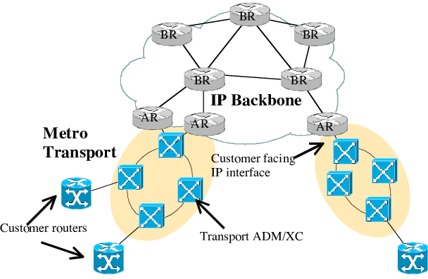
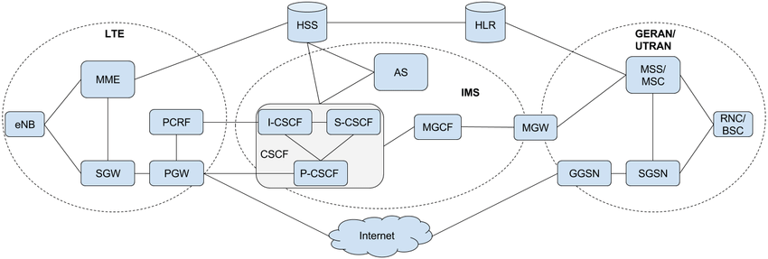
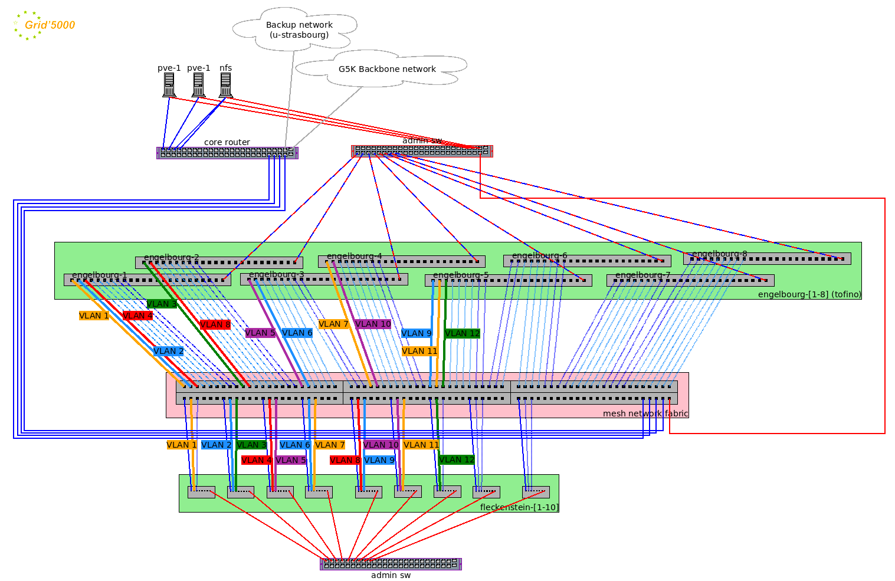
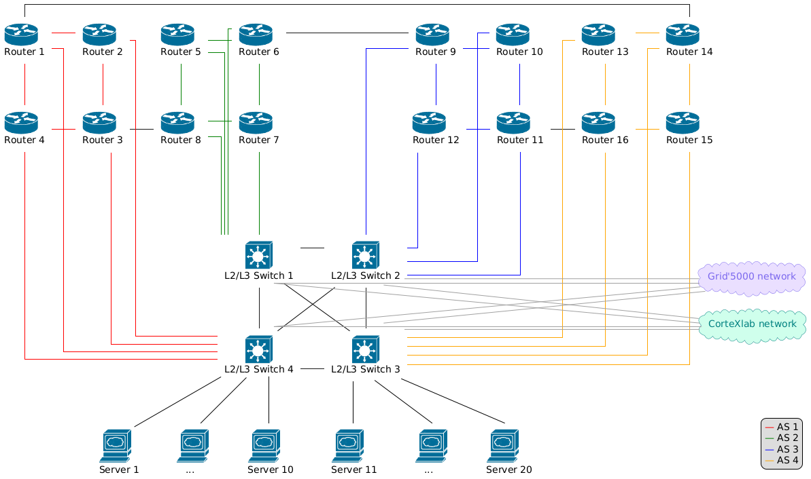
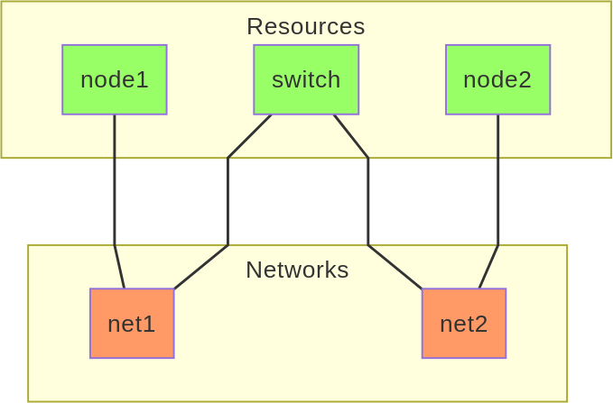

<h1>Towards a flexible Network Operating System Testbed for the
Computing Continuum</h1>

In recent years, emerging computing paradigms have paved the way for
the development of the Computing Continuum, a concept that enables
applications to efficiently allocate geo-distributed resources across
the network. Despite its potential, fully realizing the Computing
Continuum remains a challenge due to the lack of suitable research
infrastructures that support experimentation at scale.

To address this gap, we propose a conceptual testbed designed to
enhance the replicability, scalability, and robustness of Computing
Continuum and network operating system experiments. Our testbed provides
a high degree of flexibility by allowing experimenters to modify the
operating systems of network equipment and dynamically reconfigure
network topologies. To illustrate its versatility, we define three
distinct usage scenarios, ranging from multi-operator environments to
internal network architectures within telecommunication providers, all
of which can be deployed on the proposed network topology. Additionally,
this article explores solutions for virtual topology management,
operating system deployment, and service orchestration.

<!-- truncate -->

<h1>Introduction</h1>

Over the years, testbeds have evolved to fulfil more and more
scientific experiment needs. Some are evolving towards specific demands
such as Software Defined Networking, High Performance Computing, Big
Data, Artificial Intelligence, Cognitive Radio Networks, among others.
While others tend to be more generic, like for testing one or more
entire computing tiers including Cloud, Fog, Mist, Edge and
Extreme-Edge. Thus, the features regarding modern testbeds are rather
scattered, often leading to problem like the testbed being too specific
or too generic for certain experiments.

Following scientific progress, solutions of merging all the computing
tiers are appearing like the so-called “Computing Continuum”. The
Computing Continuum refers to a distributed computing model allowing
end-to-end resource orchestration that considers computation, storage
and network for applications executed across the Edge, Fog, and Cloud
computing tiers (Dustdar,
Pujol, and Donta 2023; Iorio et al. 2023). This paradigm ensures
communication and open availability between geographically distributed
computing resources (Marino and Risso
2023). The Computing Continuum often manifests in large scale
distributed applications that involve most of the computing tiers, such
as an Internet Service Provider or a video service.

When experimenting with the Computing Continuum in a scientific
context, one or more large-scale testbeds are often needed. As the
continuum may implement any computing tier from Extreme-Edge to Cloud,
the testbed network topology ought to be flexible and highly
reconfigurable. Regarding certain edge-cases, the likelihood of the
network topology necessitating to shrink or expand over time may be
high, thus requiring both vertical and horizontal scalability. Following
the likely evolving network topology needs, highly heterogeneous
equipments are needed in order to fulfil most demands. To attain this
level of flexibility, experimenters must have the ability to change,
modify, and reconfigure the operating systems of most testbed
components, including routers and switches. Although many Network
Operating Systems (NOS) have emerged, the capability to dynamically
replace the bare-metal operating system of network equipment remains
scarce.

This article thus presents the following contributions:

<ul>
<li>
Three Computing Continuum usage scenarios, detailed in <a
href="#usage_scenarios" class="ref">[usage_scenarios]</a>.
</li>
<li>
A comprehensive review of related work on network operating
systems, research infrastructures, and network topologies in <a
href="#related_work" class="ref">[related_work]</a>.
</li>
<li>
A testbed designed for Edge-to-Cloud experiments, including the
implementation of a Computing Continuum. It features: A physical network
topology described in <a href="#physical_topology"
class="ref">[physical_topology]</a> ; Dynamic reconfiguration of the
virtual network topology with tooling proposition and examples,
discussed in <a href="#topology_tools" class="ref">[topology_tools]</a>
; The ability to replace the operating systems of network equipment,
with suggested deployment solutions in <a
href="#operating_system_deployment"
class="ref">[operating_system_deployment]</a> ; Service orchestration
across the testbed, as outlined in <a href="#service_orchestration"
class="ref">[service_orchestration]</a>.
</li>
</ul>
<h1 id="usage_scenarios">Usage scenarios</h1>

To assess the feasibility and applicability of network equipment
operating systems in the edge-to-cloud continuum, we propose three usage
scenarios that represent challenges and opportunities in contemporary
networking environments.

<h2>Multi-operator</h2>

This scenario explores the inter-connectivity between Local Area
Networks (LANs), Metropolitan Area Networks (MANs), and Wide Area
Networks (WANs) managed by multiple operators. Such environments are
inherently complex due to differing administrative policies, protocols,
and operational objectives.

Key elements of this scenario include the implementation and testing
of inter-domain routing protocols, such as the Border Gateway Protocol
(BGP). BGP is critical for maintaining global internet connectivity by
enabling the exchange of routing information between autonomous systems.
Additionally, the use of Multi-Protocol Label Switching (MPLS) is
examined for its ability to enhance traffic engineering, optimize data
flows, and ensure quality of service (QoS) across interconnected
networks. By addressing these elements, this scenario aims to simulate
the challenges and solutions for achieving seamless integration and
collaboration in multi-operator settings.

<h2>Internet Service Provider to Telecommunications Service
Provider</h2>

The scenario aims to simulate the complexities of cross-provider
collaboration, particularly in environments where stringent requirements
for QoS and data integrity are paramount. Telemedicine, for instance,
requires real-time data transmission to ensure effective remote
diagnostics and treatment. Similarly, industrial automation relies on
synchronized communication to maintain operational efficiency. This
scenario investigates how ISPs and TSPs can align their infrastructures,
protocols, and service-level agreements (SLAs) to meet these demands
while minimizing latency and maximizing reliability.

<h2>Internet Service Provider Internal Network</h2>

This scenario examines the internal operations of an ISP’s network,
which must balance scalability, performance, and resilience to meet
ever-growing user demands. ISPs face unique challenges in optimizing
their internal topologies to handle high volumes of traffic while
maintaining fault tolerance and service continuity.

The scenario aims to emulate the intricate dynamics of ISP networks,
including internal routing, resource allocation, and failure recovery
mechanisms. A particular focus is placed on optimizing traffic flows to
prevent bottlenecks and ensure equitable distribution of bandwidth
across the network. Additionally, the scenario considers the integration
of emerging technologies to enhance network management capabilities and
enable proactive responses to potential issues. By addressing these
aspects, this scenario provides a framework for evaluating the
adaptability and robustness of ISP infrastructure in the face of
evolving demands and technological advancements.

<h1 id="related_work">Related work</h1>

This section describes existing testbeds, related hardware, network
operating systems and defines network topology regarding the outlined
usage scenarios.

<h2 id="existing_ri">Existing infrastructures</h2>

The two last decades have seen the rise of many research
infrastructures. These research infrastructures allow the conduct of
various computer science experiments. As visible from <a
href="#existing_ri_table" class="ref">[existing_ri_table]</a>, we have
listed many popular or emergent research infrastructures. They will be
compared in order to determine which one is able to host our proposed
testbed. As they are not all intended for the same usage, the computing
tiers involved may differ. For example, some may be rather specific for
telecom and wireless experiments like CorteXlab, whereas others tend to
provide a more generic network infrastructure like Grid’5000.

<table>
<caption>
Research infrastructures
</caption>
<colgroup>
<col style={{ width: " 41%" }} />
<col style={{ width: " 24%" }} />
<col style={{ width: " 17%" }} />
<col style={{ width: " 17%" }} />
</colgroup>
<thead>
<tr>
<th>
<strong>Infrastructure name</strong>
</th>
<th>
<strong>Computing tier(s) involved</strong>
</th>
<th>
<strong>Launch year</strong>
</th>
<th>
<strong>Current status</strong>
</th>
</tr>
</thead>
<tbody>
<tr>
<td>
SLICES-RI (Fdida et al.
2022)
</td>
<td>
Edge-to-Cloud
</td>
<td>
2022
</td>
<td>
Partially active
</td>
</tr>
<tr>
<td>
EdgeNet <a href="#fn1" class="footnote-ref" id="fnref1"
role="doc-noteref">1</a> (Friedman et al.
2019)
</td>
<td>
Edge-to-Cloud
</td>
<td>
2019
</td>
<td>
Active
</td>
</tr>
<tr>
<td>
Emulab (White et al. 2003)
</td>
<td>
Cloud/Edge
</td>
<td>
2002
</td>
<td>
Active
</td>
</tr>
<tr>
<td>
Chameleon Cloud (Mambretti, Chen, and Yeh
2015)
</td>
<td>
Cloud
</td>
<td>
2015
</td>
<td>
Active
</td>
</tr>
<tr>
<td>
Grid’5000 <a href="#fn1" class="footnote-ref" id="fnref1"
role="doc-noteref">1</a> (Bolze et al. 2006)
</td>
<td>
Cloud
</td>
<td>
2006
</td>
<td>
Active
</td>
</tr>
<tr>
<td>
FogGuru (“FogGuru Project
– Training the Next Generation of
European Fog Computing Experts,”
n.d.)
</td>
<td>
Fog
</td>
<td>
2020
</td>
<td>
No news since 2023
</td>
</tr>
<tr>
<td>
YOUPI <a href="#fn1" class="footnote-ref" id="fnref1"
role="doc-noteref">1</a> (Frédéric Le Mouël, n.d.)
</td>
<td>
Fog/Edge
</td>
<td>
2019
</td>
<td>
Active
</td>
</tr>
<tr>
<td>
CorteXlab <a href="#fn1" class="footnote-ref" id="fnref1"
role="doc-noteref">1</a> (Massouri et al. 2014)
</td>
<td>
Edge
</td>
<td>
2014
</td>
<td>
Active
</td>
</tr>
</tbody>
</table>

SLICES-RI is an ambitious European project, that is an ESFRI project
since 2021. It aims to reassemble major research infrastructure across
Europe.

The EdgeNet testbed relies on Kubernetes for its infrastructure. As
such, it only allows experimenters to deploy containers: while this
allows a good variety of Linux OS to be deployed, it does not give
access to the bare-metal hardware, and no NOS images are available.

In the Emulab testbed, users are not allowed to modify the bare-metal
network operating systems of routers and switches. However, they can
change and reorganize the virtual network topology using Emulab’s
topology description tools.

Grid’5000 grants experimenters the ability to use and modify any OS
on heterogeneous physical machines, thanks to Kadeploy, its OS
provisioning service. Kadeploy gives full control on the bare-metal
installations of clusters of machines, up to actions requiring access to
serial consoles. A work is in progress to add NOS compatibility,
allowing to automatically provision the OS of a cluster of white box
switches. The project also includes full-mesh connectivity between
8 Tofino white box switches on the Strasbourg site, allowing the
experimenter to build any virtual network topology (“Grid’5000
Site of Strasbourg and Toulouse”
n.d.).

Chameleon Cloud offers bare-metal access to physical machines like
Grid’5000, but provides a limited list of OSs to use: no NOS is part of
it. Experimenters can create isolated networks from their WebUI.

In between Cloud and Edge computing, FogGuru runs on Raspberry Pis
that are not intended to act as network equipments. In addition, like
EdgeNet, FogGuru uses Kubernetes, thus the images are not running
bare-metal.

Like Grid’5000, YOUPI is very permissive by granting full permissions
for experimenters to modify the machines. Therefore, allowing to change
for any Linux-based OS, including most NOSs. Along 2025, the platform
may evolve toward a dynamically reconfigurable network for
experimenters.

On the edge computing side, CorteXlab is exclusively oriented toward
wireless communication and does not offer the possibility to the
experimenter to modify the network virtual topology too. Also, since the
machines use Docker, the images put on are not running bare-metal.

<table>
<caption>
Existing research infrastructures abilities
</caption>
<colgroup>
<col style={{ width: " 20%" }} />
<col style={{ width: " 40%" }} />
<col style={{ width: " 40%" }} />
</colgroup>
<thead>
<tr>
<th>
<strong>Infrastructure name</strong>
</th>
<th>
<strong>Ability to modify network operating systems
bare-metal</strong>
</th>
<th>
<strong>Ability to change and reorganize the virtual network
topology</strong>
</th>
</tr>
</thead>
<tbody>
<tr>
<td>
EdgeNet
</td>
<td>
No NOS and not bare-metal <a href="#fn2" class="footnote-ref"
id="fnref2" role="doc-noteref">2</a> 
</td>
<td>
No
</td>
</tr>
<tr>
<td>
Emulab
</td>
<td>
No NOS images available
</td>
<td>
Yes
</td>
</tr>
<tr>
<td>
Chameleon Cloud
</td>
<td>
No NOS images available
</td>
<td>
Yes
</td>
</tr>
<tr>
<td>
Grid’5000
</td>
<td>
WIP on the Strasbourg site
</td>
<td>
Yes
</td>
</tr>
<tr>
<td>
FogGuru
</td>
<td>
No NOS and not bare-metal (<strong>k8s_image?</strong>)
</td>
<td>
No
</td>
</tr>
<tr>
<td>
YOUPI
</td>
<td>
Yes
</td>
<td>
Planned along 2025
</td>
</tr>
<tr>
<td>
CorteXlab
</td>
<td>
No NOS and not bare-metal (<strong>k8s_image?</strong>)
</td>
<td>
Wireless network only
</td>
</tr>
</tbody>
</table>

As summarized within <a href="#existing_ri_compatibility_table"
class="ref">[existing_ri_compatibility_table]</a>, the testbed that fits
best what we are trying to achieve is Grid’5000. It allows experimenters
to change machines” operating systems with whatever they need, and
provides the KaVLAN (“KaVLAN -
Grid5000” n.d.) services which allows
on-demand configuration of VLANs between nodes. With the upcoming
integration of white box switches in the Strasbourg site, it will allow
experimenters the capability to reconfigure the Layer 2 (L2) network
topology between a set of both experimental network switches and
servers.

The proposed testbed extends Grid’5000 capabilities by ensuring the
possibility to implement and test most of the Computing Continuum
scenarios as presented in <a href="#usage_scenarios"
class="ref">[usage_scenarios]</a>. Thus allowing repeatable, replicable
and reproducible experiments within the extensively documented
Grid’5000.

<h2>Existing Hardware and Operating Systems</h2>

In this section, we review the predominant hardware platforms and
network operating systems used in research and industry, highlighting
their relevance to Computing Continuum experimentation.

<h3>Hardware</h3>

Routers and switches serve distinct roles. L2 switches forward frames
via MAC addresses within a broadcast domain, while L3 switches add IP
routing with hardware acceleration (ASIC, TCAM) for fast inter-VLAN
communication. Routers manage WAN, complex policies, and protocol-based
routing (OSPF, BGP, MPLS) using CPU-driven packet processing for NAT and
VPNs. L3 switches approach router performance but focus on local,
high-throughput environments. The following hardware list is thus
divided into routers and switches (L2, L3).

Selecting suitable network equipment for the proposed usage scenarios
requires hardware that supports operating system flexibility,
Time-Sensitive Networking (TSN) capabilities, and Software-Defined Radio
(SDR) integration. Several white-box <a href="#fn3" class="footnote-ref"
id="fnref3" role="doc-noteref">3</a> switches and routers
meet these criteria.

For white-box switches, models such as the <strong>Edgecore
AS7326-56X</strong> and the <strong>Dell Z9264F-ON</strong> offer
high-speed switching, and TSN support for deterministic networking. On
the router side, platforms like the <strong>UfiSpace S9500-30XS</strong>
and <strong>Nokia 7220 IXR-D2</strong> provide open networking
capabilities, allowing the deployment of customizable operating systems
suited for advanced research.

<h3>Operating System</h3>

A wide variety of network operating systems are available: <a
href="#nos_list" class="ref">[nos_list]</a> lists the most popular
ones.

<table>
<caption>
Network Operating Systems
</caption>
<colgroup>
<col style={{ width: " 29%" }} />
<col style={{ width: " 19%" }} />
<col style={{ width: " 23%" }} />
<col style={{ width: " 13%" }} />
<col style={{ width: " 13%" }} />
</colgroup>
<thead>
<tr>
<th>
<strong>Operating 
System</strong>
</th>
<th>
<strong>Vendor</strong>
</th>
<th>
<strong>ASIC vendor compatibility</strong>
</th>
<th>
<strong>Target</strong>
</th>
<th>
<strong>License</strong>
</th>
</tr>
</thead>
<tbody>
<tr>
<td>
OpenWrt
</td>
<td>
OpenWrt Project
</td>
<td>
Many
</td>
<td>
Router, Switch
</td>
<td>
Free, GPL-2.0
</td>
</tr>
<tr>
<td>
VyOS
</td>
<td>
VyOS Networks
</td>
<td>
Many
</td>
<td>
Router
</td>
<td>
Free, GPL-2.0
</td>
</tr>
<tr>
<td>
SONiC OS
</td>
<td>
Microsoft, SONiC Foundation
</td>
<td>
Many
</td>
<td>
Router, Switch
</td>
<td>
Free, GPL-2.0
</td>
</tr>
<tr>
<td>
BSDRP
</td>
<td>
BSD Router Project
</td>
<td>
No
</td>
<td>
Router
</td>
<td>
Free, BSD-2-Clause
</td>
</tr>
<tr>
<td>
AlliedWare Plus
</td>
<td>
Allied Telesis
</td>
<td>
Allied Telesis only
</td>
<td>
Router, Switch
</td>
<td>
Paying license
</td>
</tr>
<tr>
<td>
Router OS
</td>
<td>
MikroTik
</td>
<td>
Many
</td>
<td>
Router
</td>
<td>
Paying license
</td>
</tr>
<tr>
<td>
SwOS
</td>
<td>
MikroTik
</td>
<td>
MikroTik only
</td>
<td>
Switch
</td>
<td>
Paying license
</td>
</tr>
<tr>
<td>
OS10
</td>
<td>
DELL
</td>
<td>
DELL only
</td>
<td>
Switch
</td>
<td>
Paying license
</td>
</tr>
<tr>
<td>
DNOS9 
(formerly FTOS)
</td>
<td>
DELL
</td>
<td>
DELL only
</td>
<td>
Switch
</td>
<td>
Paying license
</td>
</tr>
<tr>
<td>
ExtremeXOS 
(Switch Engine)
</td>
<td>
Extreme Networks
</td>
<td>
Extreme Networks only
</td>
<td>
Switch
</td>
<td>
Paying license
</td>
</tr>
<tr>
<td>
EOS
</td>
<td>
Arista
</td>
<td>
Arista only
</td>
<td>
Switch
</td>
<td>
Paying license
</td>
</tr>
<tr>
<td>
PicOS
</td>
<td>
Pica8 Software Inc.
</td>
<td>
Many
</td>
<td>
Switch
</td>
<td>
Paying license
</td>
</tr>
<tr>
<td>
Cumulus Linux
</td>
<td>
Cumulus Networks, NVIDIA
</td>
<td>
Many
</td>
<td>
Switch
</td>
<td>
Paying license
</td>
</tr>
<tr>
<td>
Junos OS
</td>
<td>
Juniper Networks
</td>
<td>
Juniper Networks only
</td>
<td>
Router, Switch
</td>
<td>
Paying license
</td>
</tr>
<tr>
<td>
iOS XE
</td>
<td>
CISCO
</td>
<td>
CISCO only
</td>
<td>
Router, Switch
</td>
<td>
Paying license
</td>
</tr>
</tbody>
</table>

A key factor in addressing the problem we aim to solve is the ability
to modify the operating system of network equipment. Consequently,
hardware compatibility plays a crucial role. The proposed testbed should
support a broad range of architectures, including both standard
x86-based platforms and white box switches, while maintaining
compatibility with ASIC-based hardware. The more an operating system
supports diverse ASIC vendors, the more versatile and valuable it
becomes for experimentation. This flexibility ensures that the testbed
can accommodate real-world deployment scenarios where proprietary ASICs
and merchant silicon coexist. Additionally, the choice of operating
system—whether proprietary or open-source—remains at the discretion of
the experimenter, allowing for a variety of research and industry use
cases.

<h2 id="existing_network_architectures">Existing network
architectures</h2>

This section focuses on the network architectures linked to the
mentioned usage scenarios in <a href="#usage_scenarios"
class="ref">[usage_scenarios]</a>. Each emphasizes realizable
experiments within the proposed testbed.

Regarding the first usage scenario, multi-operator communication,
end-to-end experimenter communication that traverses the internet must
be achievable. The average packet takes about 4.06 Autonomous Systems
(AS) path length <a href="#fn4" class="footnote-ref" id="fnref4"
role="doc-noteref">4</a> to go through the internet (Wang et al.
2016). In this work, we are going to focus on a minimal AS
network topology that involves four meshed routers. Consequently,
allowing to reproduce the average route to traverse the internet. <a
href="#scenario_topology_1" class="ref">[scenario_topology_1]</a> (Sebos et
al., n.d.) illustrates a typical ISP network topology.

<figure>

<figcaption>
Typical ISP Network Topology
</figcaption>
</figure>

The second usage scenario focuses on ISP to TSP communication, thus
allowing end-to-end experimenter communication. <a
href="#scenario_topology_2" class="ref">[scenario_topology_2]</a> from
(“Assembling VoLTE
CDRs Based on Network Monitoring –
Challenges with Fragmented Information”
n.d.) emphases the need of telecommunication hardware by
connecting internet to a VoLTE network architecture. This can be
achievable by the use of SDR cards or by interconnecting others research
infrastructures such as CorteXlab or IoT-LAB (Adjih et al. 2015).

<figure>

<figcaption>
Core network architecture serving Voice over LTE -
including 2G, 3G, 4G and IMS components
</figcaption>
</figure>

The third usage scenario, focusing on an internet service provider’s
internal network, prioritizes high performance, scalability, and
robustness. This environment enables experimentation with custom
communication protocols, fully distributed or fluid computing
architectures, and TSN, among other advanced networking paradigms, to
optimize efficiency and reliability. The network topology remains
flexible, allowing for adaptation based on specific research and
operational requirements.

A promising direction for future work is the integration of
Deep-Generative Graphs for the Internet (DGGI) (Dadauto,
Fonseca, and Torres 2024), to generate realistic network
topologies for our usage scenarios. Traditional topology generators
often fail to capture key structural properties such as betweenness,
clustering, and assortativity, which are crucial for accurately modeling
intra-AS networks. By leveraging DGGI, we could create synthetic
topologies that closely resemble real-world networks, enhancing the
validity of our testbed experiments. This approach would enable more
data-driven topology selection, improving the evaluation of routing
protocols, network OS behavior, and scalability under diverse
conditions.

<h1>Conceptual Framework</h1>

Designing an effective testbed for Computing Continuum experiments
requires a scalable and sustainable framework that supports flexibility,
reproducibility, and long-term adaptability. This section outlines the
key design principles guiding our approach, ensuring that the testbed
can accommodate diverse network environments and evolving research
needs. Additionally, we propose a structured workflow for
experimentation, detailing how network operating systems can be
integrated and deployed within the testbed to facilitate rigorous and
repeatable testing.

<h2 id="physical_topology">Physical topology</h2>

The foundation of our testbed’s physical topology is inspired by the
Grid’5000 project in the Strasbourg site to support core-network
experiments. However, certain limitations must be addressed to better
support telecommunications-oriented experiments and custom communication
protocols as seen with the usage scenarios.

<figure>

<figcaption>
Grid’5000 Strasbourg site network topology (“Grid’5000
Site of Strasbourg and Toulouse”
n.d.)
</figcaption>
</figure>

The network topology of the Grid’5000 Strasbourg site visible in <a
href="#strasbourg_topology" class="ref">[strasbourg_topology]</a> (“Grid’5000
Site of Strasbourg and Toulouse”
n.d.) consists of a core routing infrastructure interconnected to
other Grid’5000 sites, providing high-speed connectivity for distributed
computing experiments. The compute and networking experimental resources
are organized into distinct groups, notably the <code>engelbourg</code>
nodes, which consist of programmable Tofino-based white box switches,
and the <code>fleckenstein</code> nodes, which are standard HPE servers
with several network interfaces. A dedicated mesh network fabric
interconnects these resources, facilitating flexible networking
configurations thanks to L2 VLAN switching. VLAN segmentation is
extensively used, with multiple VLANs ensuring logical isolation and
controlled data flow across the infrastructure.

This design allows many different virtual topologies to be setup by
the experimenter, thanks to the mesh network fabric. However, it comes
at a cost: all network traffic between the resources must go through
this L2 fabric, preventing the use of advanced or experimental layer-2
protocols. Examples of advanced L2 usage include VLAN stacking
(802.1ad), custom QoS policies, or using the Precision Time Protocol
(PTP). Another constraint is the lack of end-device diversity,
particularly for telecommunications research, where real-world end-user
behavior and heterogeneous device interactions play a crucial role.

To overcome these challenges, we propose direct interconnection of
experimenter-controlled routers within the testbed, reducing dependency
on infrastructure switches and enabling the formation of minimal AS-like
virtual networks. This design allows for greater control over packet
forwarding, facilitates custom protocol deployment, and enhances
scalability for multi-domain networking experiments. However, this
constrains our testbed to single-user experiments: as soon as an
experimenter has full control over one network device (e.g. a L2/L3
switch in <a href="#network_architecture"
class="ref">[network_architecture]</a>), no other experimenter can
safely use the other devices because their connectivity directly depend
on each other.

A second key enhancement involves integrating Software-Defined Radio
(SDR) capabilities by equipping the testbed with PCIe SDR cards or
establishing interconnections with external research infrastructures
like CorteXlab. This addition would enable the evaluation of
wireless-networking scenarios, edge-to-cloud interactions, and hybrid
wired-wireless architectures, further expanding the scope of possible
experiments.

<figure>

<figcaption>
Proposed network architecture
</figcaption>
</figure>

The presented network topology in <a href="#network_architecture"
class="ref">[network_architecture]</a> is structured around a
multi-router, multi-switch design, facilitating flexible and scalable
networking experiments. It consists of 16 routers, which are categorized
into four distinct subnetworks (minimalist ASs), each represented by
different colors (red, green, blue, and orange) for readability. These
subnetworks are interconnected via four L2/L3 switches, forming a
hierarchical structure that ensures high connectivity while maintaining
isolation between different experimental setups.

The Grid’5000 network (Purple) and the CorteXlab network (Teal) as an
example are integrated within the testbed, allowing for external
connectivity and interaction with broader research infrastructures. The
routers within each subnetwork are directly linked to their respective
L2/L3 switches, which are in turn interconnected to enable communication
across different domains. Additionally, each core switch connects to a
pool of servers, which serve as end-hosts for various networking
experiments. To ensure the usage of network topologies tools like
KaVLAN, as described in <a href="#topology_tools"
class="ref">[topology_tools]</a>, the core switches are P4 compatible.
It is up to the experimenter to maintain P4 compatibility within the
switches operating systems to benefit from the ease of network
configuration offered by tools like KaVLAN. Furthermore, each device is
connected to an administration network (not depicted in the diagram),
which facilitates operating system changes and basic administrative
tasks, also ensuring that no connection is lost with incorrect network
configurations.

The topology enables routing experiments by supporting direct
router-to-router connections, allowing the implementation of AS-like
environments. The integration of multiple research infrastructures
ensures that the testbed is suitable for testing custom communication
protocols, software-defined networking (SDN) approaches, and
time-sensitive networking scenarios. This design avoids dependence on a
central switch, providing flexibility in defining network policies and
improving resilience against potential failures.

<h2 id="topology_tools">Virtual topology tools</h2>

Conceptually, setting up a virtual topology for an experimentation
requires three phases: 1) <strong>Defining the desired virtual
topology</strong>: The experimenter specifies the intended network
topology using a sufficiently expressive language to accommodate a wide
range of experimental setups. 2) <strong>Mapping the virtual topology
onto the physical infrastructure</strong>: This process can be handled
either by the testbed itself—leveraging tools such as
<code>assign</code> from Emulab—or by the experimenter, who selects the
most suitable physical resources. 3) <strong>Configuring physical
resources to establish the topology</strong>: The testbed automates this
step using internal tools, which allocate and configure physical nodes
while deploying VLANs to establish the necessary network links.

<h3>Virtual topology description</h3>

The experimenter must be able to describe a target topology as a
graph. More precisely, a bipartite graph offers a general
representation: the first class of graph nodes represents reconfigurable
<em>resources</em> (servers or network devices), while the second class
of graph nodes represents <em>networks</em>. A link in the graph
represents the attachment of a <em>resource</em> (through one of its
network interface cards) to a <em>network</em>. All <em>resources</em>
that are attached to the same <em>network</em> can communicate with each
other. <a href="#example-topology" class="ref">[example-topology]</a>
gives an example topology with three user-controlled <em>resources</em>:
two servers and one switch that interconnects them. This topology needs
two <em>networks</em> to represent the connectivity between the
<em>resources</em>.

<figure>

<figcaption>
Example virtual topology represented as a bipartite
graph: user-controllable resources are shown in green, while networks
are shown in red.
</figcaption>
</figure>

A resource can be described through constraints: at least 10 CPU
cores, at least 2 Ethernet 10Gbit/s network interfaces… Alternatively,
the resource description can directly refer to specific hardware
resources from a testbed (e.g. using a cluster name).

In the graph, a node of class <em>network</em> can represent many
different kinds of real networks. The simplest network is a L1
point-to-point connection, i.e. a simple cable between two devices. In
that case, only two <em>resources</em> can attach to this
<em>network</em> in the graph. More complex networks include L2 networks
(e.g. provided by a VLAN by the testbed), or the concept of “LAN” from
Emulab, defined as “a clique of nodes [resources] with full bisection
bandwidth” (Hermenier and Robert 2012).

The next step is to be able to describe this graph programmatically.
Several existing network testbeds provide a way to describe a topology
in a high-level language such as Python. We implement the example
topology from <a href="#example-topology"
class="ref">[example-topology]</a> in two testbeds: Emulab and
Grid’5000. For the sake of brevity, we only focus on the topology aspect
and omit other configuration options (e.g. which operating system should
be deployed on which resource).

<a href="#topo-example-emulab" class="ref">[topo-example-emulab]</a>
example is written in Python using <code>geni-lib</code>, simplified
from the Emulab documentation (Eric Eide et al. n.d.),
with two servers and a <strong>Dell S4048</strong> network switch:

<figure>
<pre class="py"><code>
# Add a raw PC to the request and add an interface
  node1 = request.RawPC(&quot;node1&quot;)
  iface1 = node1.addInterface()

# Add the Switch and give it some interfaces
mysw = request.Switch(&quot;mysw&quot;);
mysw.hardware_type = &quot;dell-s4048&quot;
swiface1 = mysw.addInterface()
swiface2 = mysw.addInterface()
node2 = request.RawPC(&quot;node2&quot;)
iface2 = node2.addInterface()

# Add L1 link from node1 to mysw
link1 = request.L1Link(&quot;link1&quot;)
link1.addInterface(iface1)
link1.addInterface(swiface1)

link2 = request.L1Link(&quot;link2&quot;)
link2.addInterface(iface2)
link2.addInterface(swiface2)
</code></pre>
<figcaption>
Example topology from <a href="#example-topology"
class="ref">[example-topology]</a> defined in Python with
<code>geni-lib</code>, targeted at Emulab
</figcaption>
</figure>

<a href="#topo-example-enoslib"
class="ref">[topo-example-enoslib]</a> is using EnOSlib (Cherrueau et al.
2022) on Grid’5000, with <code>fleckenstein</code> referring to
classical x86 servers and <code>engelbourg</code> referring to a
<strong>Edge-core Wedge100BF</strong> network switch:

<figure>
<pre class="py"><code>
net_conf = dict(type=&quot;kavlan&quot;, site=&quot;strasbourg&quot;)
  net1 = en.G5kNetworkConf(**net_conf)
  net2 = en.G5kNetworkConf(**net_conf)

conf = (
en.G5kConf()
.add_network_conf(net1)
.add_network_conf(net2)
.add_machine(
cluster=&quot;fleckenstein&quot;,
nodes=1,
secondary_networks=[net1]
)
.add_machine(
cluster=&quot;fleckenstein&quot;,
nodes=1,
secondary_networks=[net2]
)
.add_machine(
cluster=&quot;engelbourg&quot;,
nodes=1,
secondary_networks=[net1, net2]
)
)

provider = en.G5k(conf)
provider.init()
</code></pre>
<figcaption>
Example topology from <a href="#example-topology"
class="ref">[example-topology]</a> defined in Python with EnOSlib (Cherrueau et al.
2022), targeted at Grid’5000
</figcaption>
</figure>

Other techniques can be used to describe the topology of an
experiment: Heat templates on Chameleon Cloud (Chameleon Cloud
n.d.), and the Fablib Python library (Paul Ruth and Komal Thareja
n.d.) on the FABRIC testbed (Baldin et al. 2019).

While these approaches have differences, they all adopt a declarative
structure to describe the resources, the networks, and their
connections. We believe that a declarative approach has good properties:
it allows to validate correctness properties on the whole topology
before actually allocating resources on the testbed, and it is also a
key requirement to be able to choose the appropriate physical resources
that fit the desired topology.

<h3>Configuring physical resources to setup the topology</h3>

Setting up the virtual topology usually boils down to two categories
of actions: <strong>1) allocate and configure physical nodes</strong>,
e.g. reboot them, deploy an OS on them, configure their network
interfaces, and allow the SSH key of the experimenter; <strong>2)
allocate and deploy the desired networks and network
connections</strong>, e.g. by deploying VLANs on the infrastructure and
configuring the physical ports on which the nodes are connected. We only
focus on this second category.

Existing testbeds use dedicated tools to reconfigure the network
dynamically: KaVLAN on Grid’5000; <code>snmpit</code> (Emulab
2024) on Emulab; Neutron and Networking-Generic-Switch on
Chameleon Cloud; and a Cisco Network Services Orchestration (NSO)
controller on FABRIC. These reconfiguration tools all expose a
high-level interface (often called the northbound API) through which
network configuration requests can be made. Then, each tool exploits a
low-level interface (often called the southbound API) to communicate
with the actual network devices and update their configuration. The
southbound API can either use SNMP, SSH, or the NETCONF protocol with
appropriate YANG models.

Another interesting aspect of YANG models is the possibility to use
them as intermediate representation of network topologies. Such a
representation has the potential to be agnostic to the testbed and to
the specific network hardware to be configured. A potentially useful
model to achieve this is the YANG Data Model for Network Topologies from
RFC 8345. However, to our knowledge, this intermediate representation
approach has not been explored in current testbeds: YANG and NETCONF are
only used as the low-level southbound API by the Cisco NSO controller on
FABRIC, likely using Cisco-specific YANG models.

<h2 id="operating_system_deployment">Network Operating System
deployment</h2>

Changing the network operating system by the network while using this
same network can be tough. It can be compared to sawing off the branch
you are sitting on. Fortunately, innovative solutions have been created
such as Open Network Install Environment (ONIE) (“Open Network Install
Environment — Open Network Install Environment
Documentation” n.d.), that inherit from ONL (“ONL
Home,” n.d.). ONIE is a minimal operating system
that its only functionality is to connect to a network and waiting to
receive the image to install. Once an image is installed, the primary
boot partition is automatically set to the installed OS one. If the
operating system gets uninstalled, then the primary boot partition is
set back to ONIE’s. One of the two limitations regarding ONIE is that it
has to come pre-installed with non-white box or bare metal switches. The
other main limitation is that images that ONIE can install have to be
tweaked before proceeding, thus limiting the available options .

Various other operating system deployment tools are available,
including Kadeploy, which is actively being developed within the
Grid’5000 testbed. Kadeploy is a scalable and efficient deployment
system designed to facilitate the installation of operating systems
across multiple nodes simultaneously. It provides experimenters with the
ability to customize post-installation configurations, ensuring a
tailored deployment process. While initially developed for
general-purpose computing clusters, its flexibility allows for
adaptation to network environments, including white-box switches and
ONIE-compatible images. However, its integration with network operating
systems remains a work in progress, requiring further development to
fully support the specific needs of network infrastructure
experimentation.

<h2 id="service_orchestration">Service Orchestration</h2>

Service orchestration plays a crucial role in the efficient
deployment and management of experiments within our testbed. The
flexibility of our infrastructure allows experimenters to deploy
off-the-shelf orchestrators as part of their research, enabling the
evaluation of orchestration frameworks in real-world scenarios. This
capability is particularly relevant for studying performance,
scalability, and resilience aspects of different orchestration solutions
in a controlled yet realistic environment.

To facilitate experiment execution, we provide support for various
orchestration tools that experimenters can leverage to manage their
deployments. These tools include widely used configuration management
and automation frameworks such as Ansible, as well as more specialized
solutions like EnOSlib (Cherrueau et al. 2022) which
offer tailored functionalities for network and distributed system
experiments. By integrating these tools, experimenters can automate
system configuration, deploy network services, and manage complex
experimental workflows with minimal overhead. This approach ensures
reproducibility, scalability, and efficiency within the testbed.

Regarding the Computing Continuum, service orchestration will play a
significant role in future experiments. Kubernetes remains the most
widely used solution for simulating or emulating a continuum-like
computing model, as few alternatives have emerged over time. However, in
line with the European initiative Future European Platforms for the
Edge: Meta-Operating Systems—part of the Horizon Europe program—new Meta
Operating Systems (Meta OS) have started to appear. Each proposed
solution offers a unique perspective on achieving the Computing
Continuum, including NEMO (“HOME - NEMO
META-OS,” n.d.), FLUIDOS (“FLUIDOS,” n.d.),
ICOS (“Project
ICOS,” n.d.), NebulOuS (“Home - NebulOuS,”
n.d.), AerOS (“aerOS
Project,” n.d.), and Nephele (“Home 
Nephele,” n.d.). These Meta Operating Systems
are not all intended to be deployed on the same computing tiers. For
instance, Nephele focuses exclusively on edge devices. Whereas, FLUIDOS
lays from cloud to edge.

The Computing Continuum experiment framework, E2Clab (Rosendo et al.
2020), built on top of EnOSlib and targeted at Grid’5000, was
introduced in 2020. Its adoption facilitates real-world testing and
benchmarking of Meta OS service orchestration. Given that both E2Clab
and our proposed testbed are based on Grid’5000, we believe they are
compatible and complementary.

<h1 id="future_work">Discussion &amp; future work</h1>

In this work, we introduced a conceptual testbed designed to enhance
the flexibility, scalability, and replicability of Computing Continuum
experiments. We outlined three distinct usage scenarios, each addressing
different networking challenges and research needs. Additionally, we
reviewed existing network operating systems and research
infrastructures, highlighting their limitations and compatibility with
our approach. By enabling dynamic OS replacement and adaptable network
topologies, our testbed aims to bridge the gap between theoretical
advancements and practical deployments in next-generation networking
environments. While our testbed is conceptual, we based our work on
existing research infrastructures such as Grid’5000 to envisage a
realistic implementation. Practical validation still remains an open
challenge.

A limitation when deploying network operating systems is the
necessity to use ONIE-compatible OS images, thus limiting the available
options and slowing down OS development process. This limitation is
peering up with the non-availability of Meta OS images for the time
being. A future work for the Meta OS research field could be to get a
step closer to NOS installation solutions such as ONIE. To follow with
service orchestration, a Computing Continuum experimentation framework
like E2Clab can be pushed onto our testbed to shape a powerful and
reliable testing workflow.

The most ambitious future work for Computing Continuum
experimentation at large scale is to enable interconnectivity and
compliance of various research infrastructures. Such a research
advancement merged with our testbed proposal would empower the test of
life-sized complex experiments. Finally, establishing collaborations
with industry and research initiatives will be crucial to ensuring
real-world applicability and aligning with evolving networking and
computing standards.

Adjih, Cedric, Emmanuel Baccelli, Eric Fleury, Gaetan Harter, Nathalie
Mitton, Thomas Noel, Roger Pissard-Gibollet, et al. 2015.
“FIT IoT-LAB: A Large Scale Open
Experimental IoT Testbed.” In <em>2015
IEEE 2nd World Forum on Internet
of Things (WF-IoT)</em>, 459–64. Milan, Italy:
IEEE. <a
href="https://doi.org/10.1109/WF-IoT.2015.7389098">https://doi.org/10.1109/WF-IoT.2015.7389098</a>.

“aerOS Project.” n.d. <a
href="https://aeros-project.eu/">https://aeros-project.eu/</a>.

“Assembling VoLTE CDRs Based on Network
Monitoring – Challenges with Fragmented
Information.” n.d. In <em>ResearchGate</em>.
Accessed January 21, 2025. <a
href="https://doi.org/10.23919/INM.2017.7987410">https://doi.org/10.23919/INM.2017.7987410</a>.

Baldin, Ilya, Anita Nikolich, James Griffioen, Indermohan Inder S.
Monga, Kuang-Ching Wang, Tom Lehman, and Paul Ruth. 2019.
“FABRIC: A
National-Scale Programmable
Experimental Network
Infrastructure.” <em>IEEE Internet Computing</em> 23
(6): 38–47. <a
href="https://doi.org/10.1109/MIC.2019.2958545">https://doi.org/10.1109/MIC.2019.2958545</a>.

Bolze, Raphaël, Franck Cappello, Eddy Caron, Michel Daydé, Frédéric
Desprez, Emmanuel Jeannot, Yvon Jégou, et al. 2006. “Grid’5000:
A Large Scale And Highly Reconfigurable Experimental Grid
Testbed.” <em>The International Journal of High
Performance Computing Applications</em> 20 (4): 481–94. <a
href="https://doi.org/10.1177/1094342006070078">https://doi.org/10.1177/1094342006070078</a>.

Chameleon Cloud. n.d. “Complex Appliances — Chameleon
Cloud Documentation.” Accessed February
18, 2025. <a
href="https://chameleoncloud.readthedocs.io/en/latest/technical/complex.html#heat-orchestration-templates">https://chameleoncloud.readthedocs.io/en/latest/technical/complex.html#heat-orchestration-templates</a>.

Cherrueau, Ronan-Alexandre, Marie Delavergne, Alexandre van Kempen,
Adrien Lebre, Dimitri Pertin, Javier Rojas Balderrama, Anthony Simonet,
and Matthieu Simonin. 2022. “EnosLib: A
Library for Experiment-Driven
Research in Distributed
Computing.” <em>IEEE Transactions on Parallel and
Distributed Systems</em> 33 (6): 1464–77. <a
href="https://doi.org/10.1109/TPDS.2021.3111159">https://doi.org/10.1109/TPDS.2021.3111159</a>.

Dadauto, Caio Vinicius, Nelson Luis Saldanha da Fonseca, and Ricardo da
Silva Torres. 2024. “Data-Driven Intra-Autonomous Systems
Graph Generator.” arXiv. <a
href="https://doi.org/10.48550/arXiv.2308.05254">https://doi.org/10.48550/arXiv.2308.05254</a>.

Dustdar, Schahram, Victor Casamayor Pujol, and Praveen Kumar Donta.
2023. “On Distributed Computing Continuum
Systems.” <em>IEEE Transactions on Knowledge and Data
Engineering</em> 35 (4): 4092–4105. <a
href="https://doi.org/10.1109/TKDE.2022.3142856">https://doi.org/10.1109/TKDE.2022.3142856</a>.

Emulab. 2024. “Tbsetup/Snmpit · Master · Emulab / Emulab-Devel ·
GitLab.” <em>GitLab</em>. <a
href="https://gitlab.flux.utah.edu/emulab/emulab-devel/-/tree/master/tbsetup/snmpit">https://gitlab.flux.utah.edu/emulab/emulab-devel/-/tree/master/tbsetup/snmpit</a>.

Eric Eide, Robert Ricci, Jacobus (Kobus) Van der Merwe, Leigh Stoller,
Kirk Webb, Jon Duerig, Gary Wong, Keith Downie, Mike Hibler, and David
Johnson. n.d. “The Emulab
Manual.” Accessed February 17, 2025. <a
href="https://docs.emulab.net/advanced-topics.html#%28part._user-controlled-switches%29">https://docs.emulab.net/advanced-topics.html#%28part._user-controlled-switches%29</a>.

Fdida, Serge, Nikos Makris, Thanasis Korakis, Raffaele Bruno, Andrea
Passarella, Panayiotis Andreou, Bartosz Belter, et al. 2022.
“SLICES, a Scientific Instrument for the Networking
Community.” <em>Computer Communications</em> 193 (September):
189–203. <a
href="https://doi.org/10.1016/j.comcom.2022.07.019">https://doi.org/10.1016/j.comcom.2022.07.019</a>.

“FLUIDOS.” n.d. <a
href="https://fluidos.eu/">https://fluidos.eu/</a>.

“FogGuru Project – Training the
Next Generation of European Fog Computing
Experts.” n.d. <a
href="http://www.fogguru.eu/">http://www.fogguru.eu/</a>.

Frédéric Le Mouël. n.d. “YOUPI: Feedbacks, Ongoing
and Future Works of a Fog/ Edge Computing
Platform.”

Friedman, Timur, Rick McGeer, Berat Can Senel, Matt Hemmings, and Glenn
Ricart. 2019. “The EdgeNet System.” In
<em>2019 IEEE 27th International Conference on
Network Protocols (ICNP)</em>, 1–2. <a
href="https://doi.org/10.1109/ICNP.2019.8888122">https://doi.org/10.1109/ICNP.2019.8888122</a>.

“Grid’5000 Site of Strasbourg and
Toulouse.” n.d. Accessed February 13, 2025. <a
href="https://www.grid5000.fr/Core2EdgeNetworkXP/">https://www.grid5000.fr/Core2EdgeNetworkXP/</a>.

Hermenier, Fabien, and Ricci Robert. 2012. “How To
Build a Better Testbed:
Lessons From a Decade of
Network Experiments on
Emulab.” In, 1. <a
href="https://hal.science/hal-00710449">https://hal.science/hal-00710449</a>.

“Home - NebulOuS.” n.d. <a
href="https://nebulouscloud.eu/">https://nebulouscloud.eu/</a>.

“HOME - NEMO META-OS.” n.d. <a
href="https://meta-os.eu/">https://meta-os.eu/</a>.

“Home  Nephele.” n.d. <a
href="https://nephele-project.eu/">https://nephele-project.eu/</a>.

Iorio, Marco, Fulvio Risso, Alex Palesandro, Leonardo Camiciotti, and
Antonio Manzalini. 2023. “Computing Without Borders:
The Way Towards Liquid Computing.” <em>IEEE
Transactions on Cloud Computing</em> 11 (3): 2820–38. <a
href="https://doi.org/10.1109/TCC.2022.3229163">https://doi.org/10.1109/TCC.2022.3229163</a>.

“KaVLAN - Grid5000.” n.d.
Accessed January 29, 2025. <a
href="https://www.grid5000.fr/w/KaVLAN">https://www.grid5000.fr/w/KaVLAN</a>.

Mambretti, Joe, Jim Chen, and Fei Yeh. 2015. “Next
Generation Clouds, the Chameleon Cloud
Testbed, and Software Defined Networking
(SDN).” In <em>2015 International
Conference on Cloud Computing Research and
Innovation (ICCCRI)</em>, 73–79. Singapore,
Singapore: IEEE. <a
href="https://doi.org/10.1109/ICCCRI.2015.10">https://doi.org/10.1109/ICCCRI.2015.10</a>.

Marino, Jacopo, and Fulvio Risso. 2023. “Is the Computing
Continuum Already Here?” arXiv. <a
href="https://doi.org/10.48550/arXiv.2309.09822">https://doi.org/10.48550/arXiv.2309.09822</a>.

Massouri, Abdelbassat, Leonardo Cardoso, Benjamin Guillon, Florin Hutu,
Guillaume Villemaud, Tanguy Risset, and Jean-Marie Gorce. 2014.
“CorteXlab: An Open FPGA-based Facility for Testing SDR
&amp; Cognitive Radio Networks in a Reproducible Environment.” In
<em>2014 IEEE Conference on Computer Communications
Workshops (INFOCOM WKSHPS)</em>, 103–4. <a
href="https://doi.org/10.1109/INFCOMW.2014.6849176">https://doi.org/10.1109/INFCOMW.2014.6849176</a>.

“ONL Home.” n.d. <a
href="http://opennetlinux.org/">http://opennetlinux.org/</a>.

“Open Network Install Environment — Open
Network Install Environment Documentation.” n.d. Accessed
January 10, 2025. <a
href="https://opencomputeproject.github.io/onie/">https://opencomputeproject.github.io/onie/</a>.

Paul Ruth, and Komal Thareja. n.d. “FABRIC Testbed —
Fablib Documentation — Node.” Accessed February 18, 2025. <a
href="https://fabric-fablib.readthedocs.io/en/latest/node.html">https://fabric-fablib.readthedocs.io/en/latest/node.html</a>.

“Project ICOS.” n.d. <a
href="https://www.icos-project.eu/">https://www.icos-project.eu/</a>.

Rosendo, Daniel, Pedro Silva, Matthieu Simonin, Alexandru Costan, and
Gabriel Antoniu. 2020. “E2Clab:
Exploring the Computing Continuum Through
Repeatable, Replicable and Reproducible Edge-to-Cloud Experiments.” In
<em>Cluster 2020 - IEEE International Conference on
Cluster Computing</em>, 1–11. Kobe, Japan. <a
href="https://doi.org/10.1109/CLUSTER49012.2020.00028">https://doi.org/10.1109/CLUSTER49012.2020.00028</a>.

Sebos, P., J. Yates, Guangzhi Li, D. Rubenstein, and M. Lazer. n.d.
“An Integrated IP/Optical Approach for Efficient
Access Router Failure Recovery.” In <em>Optical Fiber
Communication Conference, 2004. OFC 2004</em>,
1:289–89. <a
href="https://ieeexplore.ieee.org/document/1359261">https://ieeexplore.ieee.org/document/1359261</a>.

Wang, Cun, Zhengmin Li, Xiaohong Huang, and Pei Zhang. 2016.
“Inferring the Average as Path Length of the
Internet.” In <em>2016 IEEE International
Conference on Network Infrastructure and
Digital Content (IC-NIDC)</em>, 391–95. <a
href="https://doi.org/10.1109/ICNIDC.2016.7974603">https://doi.org/10.1109/ICNIDC.2016.7974603</a>.

White, Brian, Jay Lepreau, Leigh Stoller, Robert Ricci, Shashi
Guruprasad, Mac Newbold, Mike Hibler, Chad Barb, and Abhijeet Joglekar.
2003. “An Integrated Experimental Environment for Distributed
Systems and Networks.” <em>SIGOPS Oper. Syst. Rev.</em> 36 (SI):
255–70. <a
href="https://doi.org/10.1145/844128.844152">https://doi.org/10.1145/844128.844152</a>.

<section id="footnotes" class="footnotes footnotes-end-of-document"
role="doc-endnotes">

<ol>
<li id="fn1">
Are precursors of the “SLICES-FR” French node of
SLICES-RI.<a href="#fnref1" class="footnote-back"
role="doc-backlink">↩︎</a>
</li>
<li id="fn2">
Kubernetes/Docker images only<a href="#fnref2"
class="footnote-back" role="doc-backlink">↩︎</a>
</li>
<li id="fn3">
Network equipment that is assembled from standardized
commodity parts<a href="#fnref3" class="footnote-back"
role="doc-backlink">↩︎</a>
</li>
<li id="fn4">
Number of autonomous systems a data packet traverses
between its source and destination<a href="#fnref4"
class="footnote-back" role="doc-backlink">↩︎</a>
</li>
</ol>
</section>
