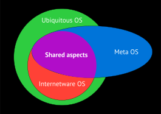

Emerging research has proposed new classes of operating systems to support pervasive, Internet-scale, or cross-domain computing. In particular, Internetware OS (from the "Internetware" paradigm), Ubiquitous OS (UOS), and Meta OS are three related concepts. Briefly, Internetware is defined as a paradigm for Internet-based applications that are "autonomous, cooperative, situational, evolvable, and trustworthy". An Internetware OS is an OS designed for such distributed Internetware applications. A Ubiquitous OS is envisioned as an OS that runs everywhere (from tiny IoT devices to cloud) and manages a "software-defined" world of devices and data. A Meta OS typically denotes an OS layer built atop existing OSs to unify heterogeneous resources across networks. These terms overlap, but emphasize different viewpoint.

<!-- truncate -->

## Architectural Models

*Internetware OS*: The architecture is a layered meta‑OS atop traditional OSs. An Internetware OS core provides abstractions for cloud and edge resources (compute, storage, network, devices) and exposes Internet-wide APIs (processing, data, networking, device APIs). It runs on existing platforms (Linux, Windows, embedded systems) but creates a new layer above them. The system is explicitly distributed and heterogeneous: Internetware applications execute across geographically dispersed nodes (cloud servers, PCs, phones, sensors, etc.), and the OS manages all of these as virtualized resources @meiOperatingSystemsInternetware2018. For example, prototypes like YanCloud and CampusOS have an OS core that mediates between low-level hardware and domain-specific frameworks (enterprise apps, mobile apps). In sum, an Internetware OS is designed for the Internet-as-a-computer: it uses a software-defined, runtime‑reconfigurable architecture to unify heterogeneous devices and networks under a common OS layer.

*Ubiquitous OS (UOS)*: A UOS uses a traditional OS-like layered structure but extended to everywhere. In principle it still provides resource virtualization and user‐level APIs, but "more generally defined for ubiquitous scenarios" @meiUbiquitousOperatingSystems2018. Architecturally, a UOS typically runs above the native OS on each device, exposing high-level libraries, SDKs and tools to applications. The design is inherently scalable and distributed: UOS can run on everything from tiny embedded devices to servers and cloud clusters. For example, UOS prototypes include TinyOS for sensor motes, Android Things for IoT devices, and abstract "CityOS" or "HomeOS" layers for smart homes and cities. In effect, a Ubiquitous OS is an umbrella "software-defined" layer across all hardware and networks, with common runtime support (APIs, virtualization) but typically specialized per domain.

*Meta OS*: A Meta OS is by definition an OS-on-an-OS. It is built on top of conventional OS platforms to coordinate multiple systems. As Trakadas et al. summarize, "a meta‑OS is built on top of a typical operating system, providing basic OS functionalities ... allowing communication between different nodes and managing the resources across them" @trakadasReferenceArchitectureCloud2022. In practice this often means a peer-to-peer or cloud-edge architecture @eucloudedgeiot.euMetaoperatingSystemsProjects2023: each node runs a small "meta" agent that advertises its resources, and a coordination layer handles orchestration. For instance, the RAMOS reference architecture abstracts each device’s resources via a "node abstraction layer" and uses a P2P protocol for coordination. Like Internetware OS, a Meta OS unifies heterogeneous resources, but its emphasis is on cross-domain integration: it spans multiple OS instances and administrative domains (industrial IoT, edge clusters, cloud). Popular examples include the Robot Operating System (ROS) and its successor ROS 2, which act as meta-OSes for robotics – they sit on Linux, expose device drivers and messaging in a unified API, and let robots interoperate. In sum, a Meta OS’s architecture is a high-level distributed OS framework that "runs above existing OSs" and treats the network of devices as one continuum.

## Functional Goals

*Internetware OS*: The primary goal is to support Internetware applications. I.e. highly distributed, adaptive Internet services. Internetware apps are autonomous, cooperative, situational, evolvable, and trustworthy. An Internetware OS therefore aims to manage Internet-scale resources and enable these characteristics. It provides dynamic resource management (allocating cloud/edge compute, data, etc.), supports interoperability across domains (cloud–device–network), and fosters runtime adaptability (e.g. self-configuration and adaptation when network conditions or loads change). In effect, the Internet itself becomes a "computer", so the OS addresses challenges of large-scale composition and evolution. Thus its goals include seamless device/cloud integration, support for context/situation-awareness (since apps must respond to changing environments), and built-in trust/security mechanisms for open Internet settings. It has evolved now from a software paradigm into research prototypes aimed at smart environments like cities, campuses, and industrial automation, with notable projects emerging especially in China.

*Ubiquitous OS*: UOSs aim for seamless pervasive computing. Concretely, its goals are to virtualize and orchestrate resources in any environment like smart homes, cities, vehicles, wearable devices, etc. This includes context-aware features (sensing location, user preferences, social context) so that apps can automatically adapt. A UOS provides uniform programming models so developers can write apps without worrying about underlying hardware diversity. In practice, UOS efforts have targeted end-user experience and IoT integration. For example, UOS prototypes like HomeOS (for smart homes) provide holistic device orchestration and intuitive user interfaces, while City OSes offer global city data abstractions (energy, transport, etc.).

*Meta OS*: The functional goal is cross-domain integration and orchestration. A Meta OS aims to present a single programming and management model over diverse hardware and networks. It is motivated by the need to support complex distributed applications (big data, AI, IoT analytics) that run across organizational and technological boundaries. Key goals include enabling decentralized intelligence (e.g. swarm AI on edge devices), maintaining trust and autonomy of each domain, and handling extreme heterogeneity at scale (billions of IoT devices). Thus a Meta OS provides middleware for federated data access, coordinated service orchestration, and unified interfaces across the IoT–edge–cloud or Computing continuum. For instance, it might allow an application to transparently utilize resources from multiple clouds and edge clusters as if under one OS. In robotics, the meta-OS goal is to let robotic components interoperate across platforms (as ROS does). In sum, a Meta OS focuses on universal coordination: making disjoint systems appear as one unified infrastructure. Recent research emphasizes unified management across diverse infrastructures, making it a contemporary response to increasingly complex computing ecosystems.

## Terminology: Synonyms or Distinct Concepts?

As shown in Figure 1, these terms overlap but are not strict synonyms. All three describe OS paradigms beyond traditional desktop/server OSs, but with different emphases. "Ubiquitous OS" is the broadest label – it includes any OS running on any object in a pervasive computing world. In contrast, "Internetware OS" comes from a specific research field, emphasizing Internet-scale autonomic apps. It is essentially treated as one kind of Ubiquitous OS. "Meta OS" is conceptually orthogonal: it refers to OS layers for integrating heterogeneous platforms, regardless of whether the domain is Internetware or ubiquitous computing. For example, ROS is both an Internetware OS example and a Meta OS example. In practice, the literature tends to use these terms to reflect focus rather than strict taxonomy. Some authors group them, but more often they highlight differences: Internetware OSs handle large-scale adaptability, UOSs handle device-pervasion and context, and Meta OSs handle cross-layer coordination. Thus, while related, each term has its own flavor and typical use in research.
<figure>

<figcaption>
Conceptual relationships among Ubiquitous, Internetware, and Meta Operating Systems
</figcaption>
</figure>
