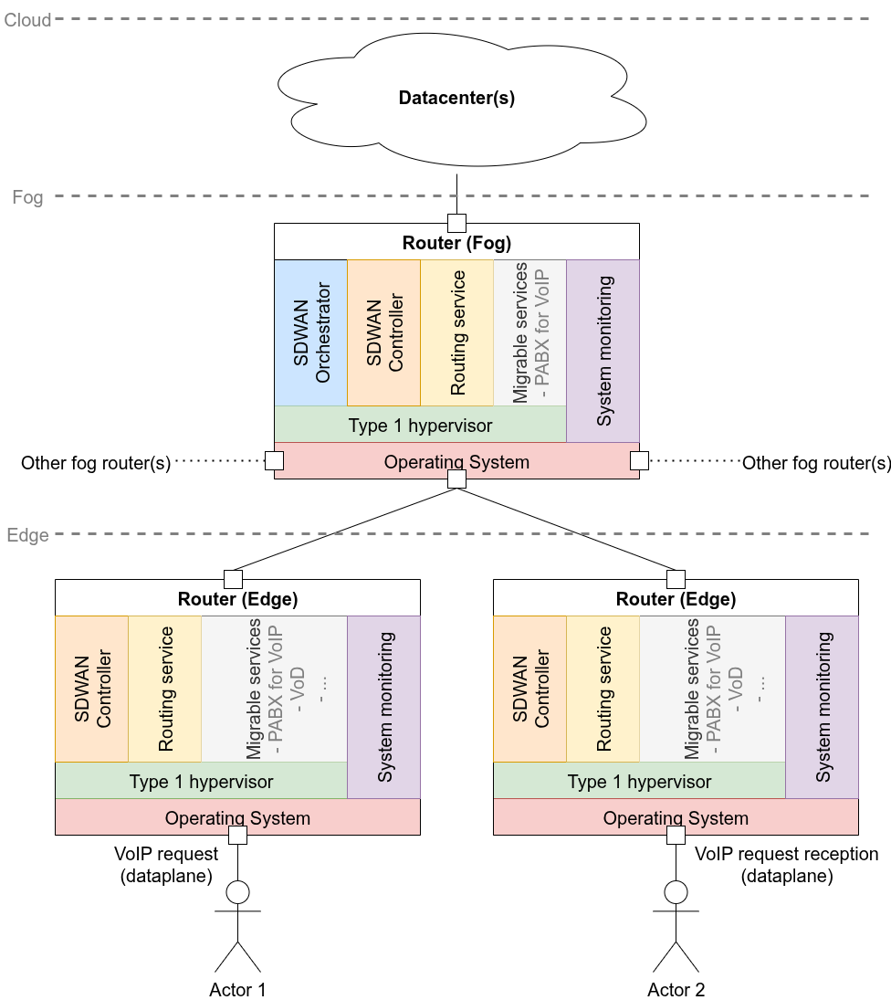
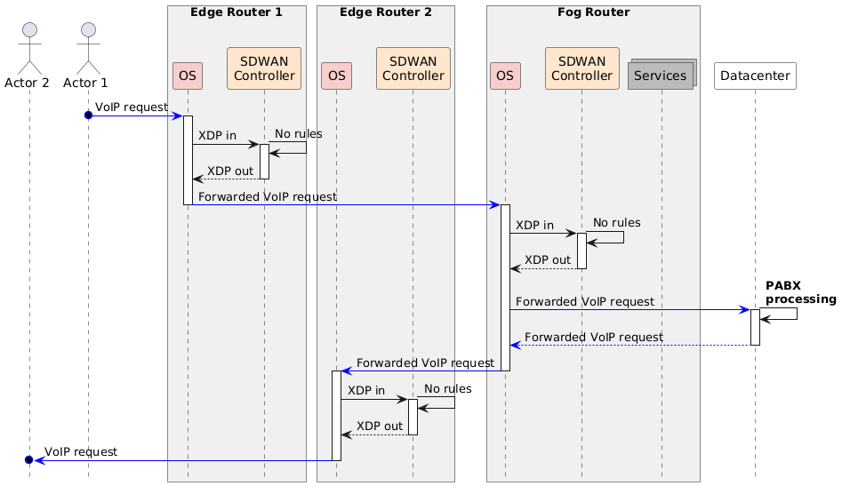
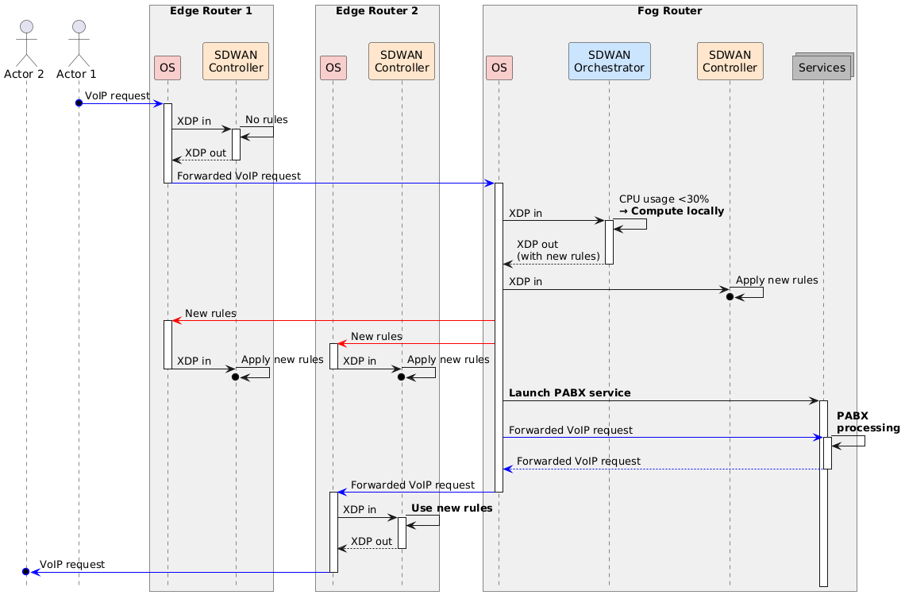

# Introduction and Context

This abstract explores the concept of a router operating system designed
for ubiquitous computing environments, leveraging a type-1 hypervisor to
host virtualized services like Internet Service Provider (ISP)
offerings. The main proposition is to integrate an augmented version of
Software-Defined Wide Area Network (SD-WAN) components, such as
orchestrators and controllers ("SD-WAN Orchestrator -- Centralized
Management, Automation & Analytics" n.d.), into the router OS, enabling
it to act as a meta-operating system (Chochliouros, Pages-Montanera, and
Alcázar-Fernández 2023). This setup aims to manage network traffic and
computational tasks efficiently, particularly in fog and edge computing
scenarios, while ensuring routing performance remains unaffected through
shared policies and rulesets.
<!-- truncate -->

# Background and Problem Statement

As the demand for low-latency, high-bandwidth services continues to
grow, routers are increasingly expected to perform functions beyond
traditional traffic forwarding. This shift is driven by the rise of fog
computing, where data is processed closer to the source to reduce
latency and bandwidth consumption, and edge computing, where compute
resources are scarce and must be used judiciously (Phan et al. 2021). In
such contexts, routers are no longer passive conduits but active
participants in service delivery.

Modern geo-distributed applications---such as Voice over IP (VoIP),
Video on Demand (VoD), Internet Protocol Television (IPTV), Virtual
Private Networks (VPNs), and Content Delivery Network (CDN)
caching---require localized compute and storage capabilities to meet
quality of service (QoS) demands (He, Toosi, and Buyya 2021). Handling
these services at or near the network edge necessitates an architectural
shift in router design, enabling them to execute lightweight computing
tasks while maintaining high-performance packet forwarding.

This evolution is technically feasible due to routers and switches
operating on Linux-based systems such as SONiC, OpenWRT, VyOS, and Cisco
IOS XE (Caposiena et al. 2025). These systems typically support the
Kernel-based Virtual Machine (KVM), which, when used with minimal host
overhead, approximates the capabilities of a type-1 hypervisor.

Despite these advances, several challenges remain unresolved. Most
notably, there is a lack of integrated operating system frameworks that
manage both routing and service orchestration in a resource-aware,
distributed fashion. Routers need to be able to dynamically assess
whether to execute a service locally or offload it to nearby nodes, all
while ensuring that such operations do not interfere with their primary
function. The absence of such a framework limits the potential of edge
and fog networks to meet the evolving demands of modern distributed
applications.

# Proposed Solution

As depicted in [system_architecture](#system_architecture),
the proposed system architecture is structured across multiple layers,
beginning with the hardware layer (each square), which consists of the
physical components of the router. This includes compute, memory, and
network interfaces capable of supporting a lightweight bare metal host
operating system (red), ensuring minimal overhead and high performance.

Above this lies the hypervisor layer (green), which is responsible for
creating, managing, and isolating virtual machines (VMs). As shown
later, three types of VMs operate within this layer. To preserve
line-rate performance and low-latency forwarding, network routing is
given the highest scheduling priority and dedicated resource
allocations, such as reserved CPU cores and memory. This guarantees
deterministic behavior, unaffected by the load of other VMs.

Migrable service VMs (M. Liu et al. 2024; He, Toosi, and Buyya 2022; D.
Liu et al. 2024) operate to host virtualized network functions (gray)
such as a PABX for VoIP. These VMs are strongly isolated from the
routing plane to avoid interference, and their instantiation is governed
by current resource availability and predefined policies.

The third category includes SD-WAN virtual machines, which provide
distributed network intelligence and act as the system's control and
coordination layer. In fog deployments, both an SD-WAN orchestrator VM
(blue) and a controller VM (orange) are instantiated. The orchestrator
is responsible for assessing local and neighboring resource conditions,
making service placement decisions, and offloading tasks to nearby
routers within one to two hops. In contrast, edge routers deploy only
the SD-WAN controller VM, which enforces network policies and
dynamically adjusts routing paths based on instructions received from
orchestrators. Together, these components form a meta-operating system,
overseeing distributed computation, connectivity decisions, and
real-time orchestration.

To enhance this architecture, we envision an augmented SD-WAN protocol
that incorporates new system-level metrics such as CPU time or memory
usage percentage. Each host exposes these metrics through a dedicated
system monitoring process (purple), which continuously tracks resource
consumption and system load. The SD-WAN VMs are paravirtualized,
granting them access to this monitoring interface without requiring full
hardware emulation. This design allows the SD-WAN orchestrator to
retrieve real-time telemetry---including CPU and memory utilization, and
I/O activity---via the exposed monitoring process.

A critical function of the SD-WAN orchestrator is policy-driven resource
management, ensuring that performance-critical operations like routing
are never compromised. For example, a policy may dictate that VoIP
services can only be instantiated when memory usage remains below 30%.
Leveraging the enriched telemetry and augmented SD-WAN protocol, the
SD-WAN orchestrator can make intelligent, latency-sensitive decisions
about whether to run services locally or offload them to other routers
or data center. This ensures optimal latency, bandwidth utilization, and
system stability, all while maintaining the router's primary role:
high-performance, reliable packet forwarding.

[example_normal_sequence](#example_normal_sequence)
illustrates a typical VoIP call between two users connected through edge
routers. Actor 1 initiates a VoIP request, which is received by the
operating system of Edge Router 1 and passed to its SD-WAN controller
via the XDP data path. Since no local service rule matches, the request
is forwarded to a fog router, which also finds no local processing rule
available. Consequently, the fog router forwards the request to a remote
data center for PABX processing. The processed VoIP traffic is then sent
back through the fog router to Edge Router 2, which delivers it to Actor

However in [example_sdwan_sequence](#example_sdwan_sequence),
which temporarily succeeds the previous diagram, the orchestrator
determines that local execution is viable by evaluating system metrics.
It then installs new routing and service policies across all involved
routers via the control plane (red arrows). The fog router subsequently
launches the PABX service locally, processes the VoIP traffic in data
plane (blue arrows), and forwards the result directly to Edge Router 2,
which delivers it to Actor 2. This interaction highlights dynamic,
policy-driven decision-making, with local service execution enabled by
real-time resource awareness. For clarity, both figures illustrate
actions as synchronous, though in reality, many of these operations may
occur asynchronously.

# Discussions

This architecture offers several key benefits. By enabling local
processing of services such as VoIP, it should significantly reduces
latency and improves responsiveness for real-time applications. The use
of a type-1 hypervisor allows for efficient resource utilization through
hardware sharing, maximizing the use of available compute power.
Virtualized services also bring greater flexibility, allowing for rapid
deployment and dynamic scaling---particularly advantageous in fog
computing scenarios. Furthermore, integrating SD-WAN simplifies network
management by centralizing control, which facilitates policy enforcement
and enhances visibility through distributed analytics. Our concept can
be tested on platforms like the Grid'5000 Strasbourg site, which is
actively developing support for deploying router operating systems on
its hardware infrastructure (Caposiena et al. 2025).

However, this approach also presents notable challenges. Without careful
resource allocation, service VMs could interfere with core routing
functions, limiting their utility. Lastly, coordinating distributed
computation across multiple routers in dynamic network environments
introduces scalability concerns that must be addressed for the system to
function effectively at large scale, e.-g. with distributed SD-WAN
Orchestrators (M. Liu et al. 2024; He, Toosi, and Buyya 2022; D. Liu et
al. 2024).
