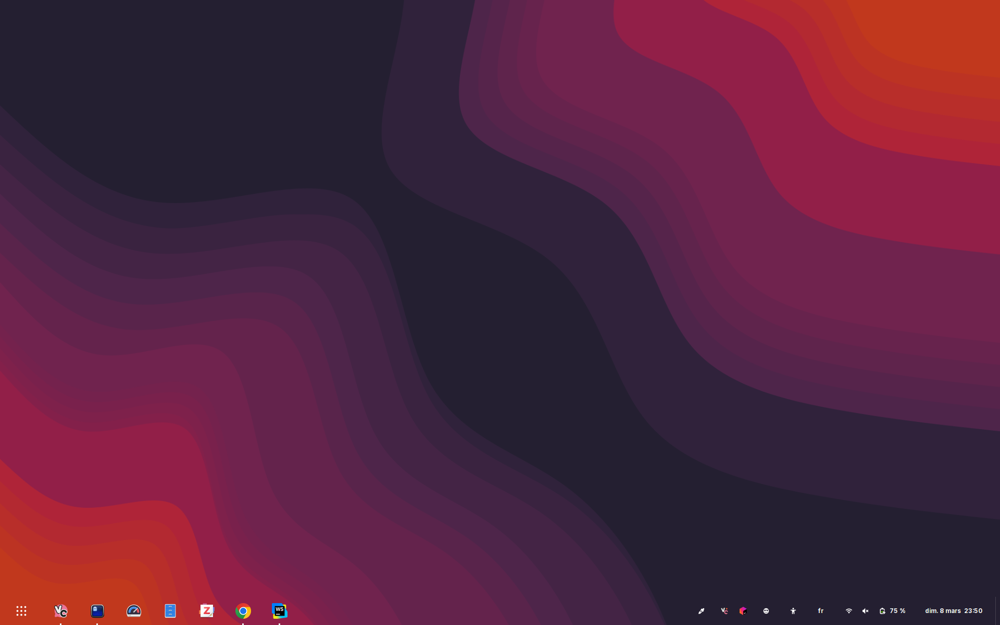
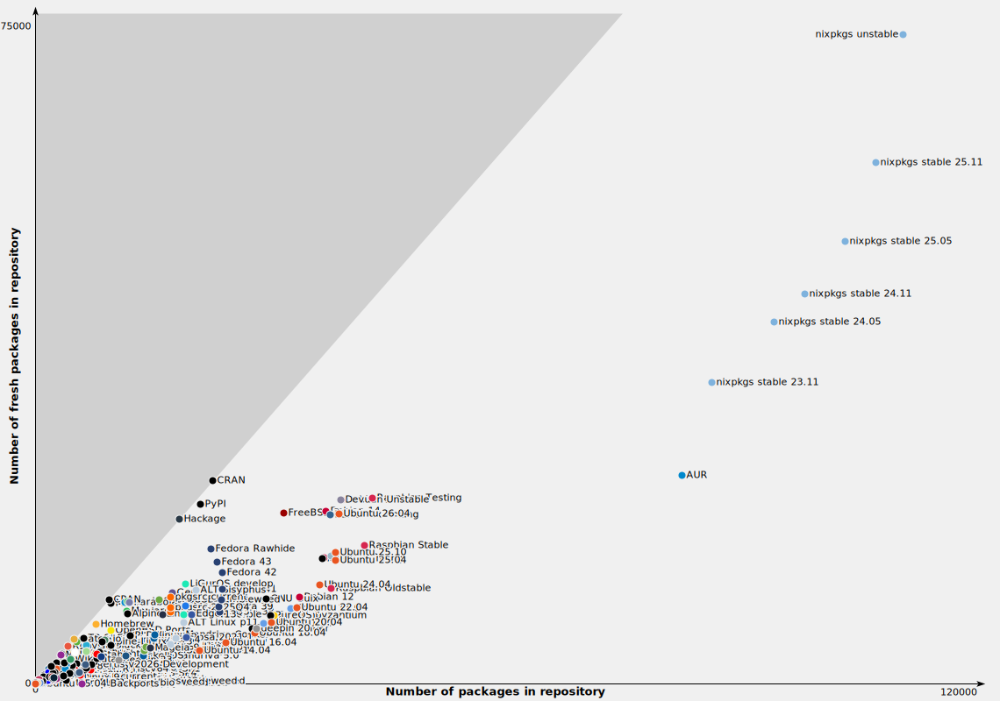
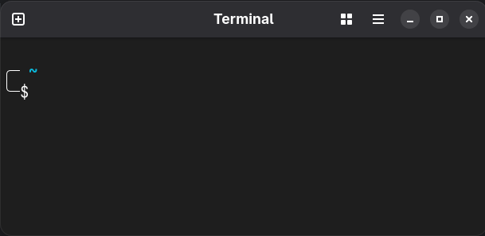
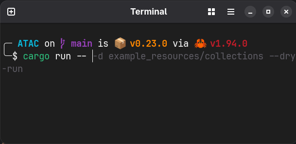

Hello all!

Today, a non-scientific blog post about distros, package managers and terminal stuff I use as a daily driver :)

## Introduction & problem statement

For most of my life as of now, I have been booting Windows daily.
As my computer science studies were continuing, I slowly switched to Linux over the years.
Like a lot of people do, I was confused about everything and did not have a clear separation of each component in mind.
Wtf is a desktop environment? I tried many things: Ubuntu, Debian stable, Fedora, double boot, KDE, GNOME, ... but all of them seemed so sketchy.
This led me to break many Debian installs over dumb shit, spending endless time trying to fix the unfixable over a [Clonezilla](https://clonezilla.org/clonezilla-live.php) chrooted into my OS.

<!-- truncate -->

While I was learning the hard way (as it is supposed to be), I was also gaining experience in CS and critical thinking about it.
I can now clearly identify the hurdles that new technical Linux adopters meet:
- **Clear component separation**
  - Linux is the kernel, like a base
  - Debian, Fedora, Ubuntu, ... are distributions (distros) of Linux, with other software and a specific philosophy (e.g., gaming, dev)
    - GNOME, KDE, i3, ... are desktop environments (DEs), with also bundle much software (e.g., terminal app, settings app, calculator)
    - APT, DNF, Pacman, ... are package managers, which let you install software and lets you resolve conflicts
    - Terminal things
      - Bash, Zsh, Fish, ... are shells, which is interface between you and your computer
      - Konsole, Terminator, Ghostty, ... are terminal emulators, which allows you to communicate with your shell
      - Starship is shell prompt 
      - Kitty is both a terminal emulator and a protocol
- **Understand where and what to expect**
  - _What do you expect from your kernel?_
    - To have great performances and never break, I guess?
  - _What do you expect from your distro?_
    - Well, it depends on its philosophy sure, but for most of us it's that it does not compromise other components' expectations
  - _What do you expect from your DE?_
    - To match your personal taste and provide a satisfying user experience
  - _What do you expect from your package manager?_
    - To provide latest software, great compatibility, a lot of packages, and to be good at resolving package conflicts
  - _What do your expect from terminal things?_
    - Well, to be customizable, fast, and probably portative

By reading this you may have been like, "Hmm, yes we all know that, what is the problem?".
The problem is the fact that most basic configs have a lot of cons:
a stable Debian takes you back to a decade ago, fedora/dnf installation is far from being supported everywhere, Ubuntu may break at each major release.
On the other hand, more complex configs can solve a lot of those problems but can also be a pain in the ass to maintain:
NixOS may break every day, Arch will slurp your time like it has no value, and exotic distros and OSes may never be compatible with that one thing.

After spending time thinking about many combinations, I think that I found the one!

## The concept

I present you the Debian, Nix, DistroBox combo: rock-stable, up-to-date, portative, replicable, simple to use and install, compatible with anything Linux-based

### Debian

Yes, I choose Debian. But why you might ask?

- First, Debian has been around for ages, so that a lot of other distros are even based on it. It has achieved legendary stability.
- Second, Debian is compatible with almost anything. Some years ago I would have written that every software has the "Debian/Ubuntu" installation section... it would not have aged well. We'll discuss that later in the [Nix part](#nix).
- Third, its principal con, spoken about in the section below, is more of an APT problem instead of Debian itself. [Nix part](#nix) too I guess.

#### Updates: more than not enough, but not too much either

Well, I was not really talking about Debian as you may think of it. The philosophy of Debian is to be as stable as possible, thus expanding stability tests to months and sometimes even years.
The main problem that you encounter with Debian is that packages are OLD. Like, seriously, gcc 10 in 2026???
It might be frustrating at first, but it is like this for a good reason. They want to achieve perfect stability, which is pretty fair to me.
Thankfully enough, Debian comes in different flavors. Not only does it have a stable branch, but also an unstable and a testing one, each representing a stage of package version.
The main branch (stable) is the default one, where packages are extremely stable but also very old. For instance, you may struggle to compile a lot of things when on this branch.
The unstable branch is intended for new packages and new versions of packages, not a lot of things have been tested out and Debian cannot offer you any warranty about it.
Things can break, and you'll probably have to wait one or two weeks before a fix gets released and ends up on the unstable branch. Both branches are not what I expect from a distribution.
However, the third one, called "testing", fits perfectly. Testing contains all the packages that are going through a testing phase after finishing the unstable phase.
Each package will iterate in this phase until it is labeled as stable enough so it can end up in the main branch (stable).
It is important to note that Debian's unstable and testing phases are already as rigorous as much as other distros' stable branches.
Now you might ask, "Cool, but aren't testing-branch packages old to?". In short, no.

Let's take the two most important examples, the Linux kernel and my desktop environment.
As of today, Sunday 8th March 2026, with Debian testing, I get the following output when using `uname -a`:

```
Linux julien-cpsn 6.18.15+deb14-amd64 #1 SMP PREEMPT_DYNAMIC Debian 6.18.15-1 (2026-02-27) x86_64 GNU/Linux
```

So mine is 6.18.15, released February 27th 2026 and out in Debian testing March 8th 2026.
Whereas Linux's latest "stable" version is currently 6.19.6.

Another example would be that I am currently on GNOME 50.beta, which was released January 31st.

On average, you'll wait from 2 weeks to 1 month after a package release to obtain it on Debian testing.
I think that is more than a cheap amount of time to pay for such rigorous testing workflows both on the software itself and Debian, isn't it?

Testing takes time and is inevitable if you want to boot your system without any trouble everyday

#### Is the desktop environment really that important?

In short: No. It is up to your taste. A desktop environment is essentially a bundle of utility software, aesthetics and a compositing window manager.

Debian supports most of the popular desktop environment: GNOME, KDE, Cinnamon, Hyprland, i3, LXDE, LXQt, MATE, XFCE

I choose GNOME because of the cool and complete utilities, the "simple" customizability, and the overall look and feel. It well represents what I expect from a desktop environment.
I changed the dock to a panel using the [Dash to panel](https://github.com/home-sweet-gnome/dash-to-panel) extension, along with [gnome-shell-extension-appindicator](https://github.com/ubuntu/gnome-shell-extension-appindicator) and [emoji-copy](https://github.com/felipeftn/emoji-copy) to have more of a Windows-like feeling.

**Pro-tips**: having a 16/10 screen ratio left me with almost normal 16/9 windows once you visually remove the space taken by the panel.

In case you are curious, here's what it looks like:



The full dash-to-panel config is available [here](https://github.com/Julien-cpsn/dotfiles/blob/main/dash-to-panel)

### Nix

Now we are entering the fun part! Take a seat.

Nix contains many things: a foundation, a distribution, a package manager, a scripting language, and probably some more.
First, let's define the nix package manager, and then differentiate it with NixOS. Well the documentation says it all:

_"Nix is a purely functional package manager. This means that it treats packages like values in purely functional programming languages such as Haskell — they are built by functions that don’t have side-effects, and they never change after they have been built. Nix stores packages in the Nix store, usually the directory /nix/store, where each package has its own unique subdirectory such as `/nix/store/b6gvzjyb2pg0kjfwrjmg1vfhh54ad73z-firefox-33.1/` where b6gvzjyb2pg0… is a unique identifier for the package that captures all its dependencies (it’s a cryptographic hash of the package’s build dependency graph). This enables many powerful features."_

NixOS is essentially a pure Linux with the Nix package manager (`/nix`) integrated. The little twist being that your system packages are managed by Nix, which is part of the trouble...

#### The Good

Before talking about bad things, let's talk about Nix's avantages compared to APT, DNF, Pacman and so on.

- **First**: Package amount. This graph says it all. ([source](https://repology.org/repositories/graphs))

- **Second**, the awesome part: Nix allows you to cohabit multiple versions of a package. Yes, I need gcc 10 and 14.
- **Third**: Nix allows you to separate development environments with its nix shells.
<details>
  <summary>Example for an esp32/rust project</summary>

  ```nix title="shell.nix"
  let
    nixpkgs-esp-dev = builtins.fetchGit {
      url = "https://github.com/mirrexagon/nixpkgs-esp-dev.git";
    };
  
    pkgs = import <nixpkgs> { overlays = [ (import "${nixpkgs-esp-dev}/overlay.nix") ]; };
  
    esp-idf = pkgs.esp-idf-full.override {
      rev = "v5.4.1";
      sha256 = "sha256-5hwoy4QJFZdLApybV0LCxFD2VzM3Y6V7Qv5D3QjI16I=";
    };
  in
    pkgs.mkShell rec {
      buildInputs = with pkgs; [
        # Standard development tools
        pkg-config
        flex
        gperf
        bison
        cmake
        ninja
  
        # Libraries needed for ESP-IDF and libclang
        openssl
        libffi
        libusb1
        libclang
        stdenv.cc.cc.lib  # This provides libstdc++.so.6
        zlib
        ncurses
  
        ldproxy
        espup
        espflash
        esp-idf
      ];
  
      LIBCLANG_PATH = "${pkgs.llvmPackages.libclang.lib}/lib";
      LD_LIBRARY_PATH = "${pkgs.lib.makeLibraryPath buildInputs}:$LD_LIBRARY_PATH";
  
      /*
      shellHook = ''
        export PATH="${esp-idf}/python-env/bin"
      '';*/
  }
  ```
</details>

- **Fourth**: [Home-manager](https://nix-community.github.io/home-manager/) allows you to handle your whole user like nix shell. It is solely responsible for all the portability and replicability. Examples will be shown later.
- **Fifth**: Packages are easily findable through [this website](https://search.nixos.org/packages)

#### The Bad

The main problem that you may encounter with Nix is that you have to learn a whole new language.
It's really not that great, has a tone of flaws, and is not really conventional, but well... it's overcomeable.
The other problem is, struggling to find someone who has already encountered your problems.
But keep in mind that if you do not take part in this system, this issue will never get resolved.

#### The Ugly

As anyone who's discovering Nix(OS), you'll probably be like "So I can manage my drivers and all important stuff more easily with Nix?"
That's the neat part, you don't. Or at least, I do not recommend you to do so.
This brings A LOT of instability in core components of your operating system and will need a separate config for each computer.
If you don't trust me, type "nixos driver problem", "nixos sound problem", "nixos gpu problem", "nixos boot problem" or whatever in your favorite search engine and look at the publication date.

The whole "what do you expect from X" bullet-list was almost entirely made for this point:
The last thing you want for your daily driver is to break at the beginning of a work day or class. You rather want an extreme stability without compromising on package latest updates.
Most of the benefits of NixOS comes from Nix, which is the real plus. Luckily enough, it can be installed on any Linux distribution.

### DistroBox

DistroBox describes itself as:

_"Use any Linux distribution inside your terminal. Enable both backward and forward compatibility with software and freedom to use whatever distribution you’re more comfortable with. Distrobox uses podman, docker or lilipod to create containers using the Linux distribution of your choice. The created container will be tightly integrated with the host, allowing sharing of the HOME directory of the user, external storage, external USB devices and graphical apps (X11/Wayland), and audio."_

In short, it allows you to load any distro chrooted into yours.
For example, you can create a Fedora guest and install dnf packages on it while accessing your own filesystem. All linked with your system's drivers.

DistroBox is entirely scriptable and usable with configuration files, both can be used along with home-manager.
You can also create host aliases to guest-installed commands.

Its benefits will be revealed in the [usage section](#usage)!

### Bonus: Terminal

This section is just to show off. I use the ZSH shell (syntax-highlighting, auto-completion), Starship prompt, and Ghostty terminal emulator

**Blank prompt**:



**ZSH auto-completion and syntax-highlighting example within a Rust codebase**:



All the config is bundled within my home-manager config as depicted in [usage](#usage)

## Usage

Now that we have gone through all these technologies, it is time to assemble them together!

1. First, we pick **Debian on the testing branch**. Its role is to never break.
   - **Add your preferred desktop environment**
   - **APT**:
     - Install and update EVERY core component to maximize stability (e.g., drivers)
     - Avoid installing other things (e.g., no gcc, no python, no sqlite, ...)
2. Second, we pick our package managers
  - **Nix**:
    - Install and update EVERY non-core and non-graphical component throughout home-manager (e.g., docker, gcc 10, gcc 14, python, sqlite, ...)
    - Manage and use nix shells
    - Nix flakes
  - **Flatpak/Snap**:
    - Install and update EVERY graphical applications (explained in [future work](#future-work))
3. Third, we pick a **terminal config** (shell, prompt), create aliases, and put it in your home-manager
4. Fourth, install **DistroBox** and create the guests you need to complement the current installation. E.g., you are on a Debian host and you need a Debian-only command that'll install a lot of dependencies, then you can install it on your Debian guest and alias it to your host.
5. Bundle everything to a GitHub repo
6. Replicate on any computer, no matter the architecture, everything adapts.

You can see a complete example in my [dotfiles](https://github.com/Julien-cpsn/dotfiles). They contain:
- <details>
    <summary>My daily-driver home-manager config</summary>
  
    ```nix reference title="/home/julien/.config/home-manager/home.nix"
    https://github.com/Julien-cpsn/dotfiles/blob/main/home.nix
    ```
  </details>
  - Every non-core and non-graphical packages
  - All of my zsh/starship config (history, aliases, environment variables, full prompt, key bindings)
  - User informations
  - Garbage collection
- A dedicated copy of my home-manager targeted to servers (e.g., vps, homelab)
- A Windows 10-like dash-to-panel config
- <details>
    <summary>An installation procedure</summary>
  
    ```md reference title="Installation procedure"
    https://github.com/Julien-cpsn/dotfiles/blob/main/README.md
    ```
    </details>
- A reference nix-shell

With this setup you will never ever have to face the struggle of not booting up for no reason.
Your packages will be up to date, tested, and compatible with your system. You can even choose to use the nix unstable channel, pick a specific version of a package, have multiple version of one package.
All of your preferences, packages are stored in one to three files within a GitHub repo, accessible from anywhere. 
Everything is replicable on any Linux (preferably Debian machines) such as your laptop, your homelab or your vps.

Do not forget to update your system:
- Update the system via `sudo apt update && sudo apt upgrade`
- Update nix packages with `nix-channel --update && home-build && home-switch`
- Update graphical apps with `sudo flatpak update`

Once you add a package to your home-manager and/or that you are satisfied enough, also update the config in the GitHub repo and pull it on other devices.

I have been using this whole config on four devices for about one year and a half. Everything works like a charm!
The only hurdles are often encountered in desktop graphical applications which use GTK, but I always win the war.

Enjoy!

## Future work

The main problem by the time being is the lack of great support for non-NixOS GPU drivers.
It can be achieved through wizardry, but it is not what this blog post was aiming for.
The home-manager devs are trying to fix it as we speak.
I personally use flatpak for every graphical application, and it does the job really well.
The only drawback being the size of the packages.
