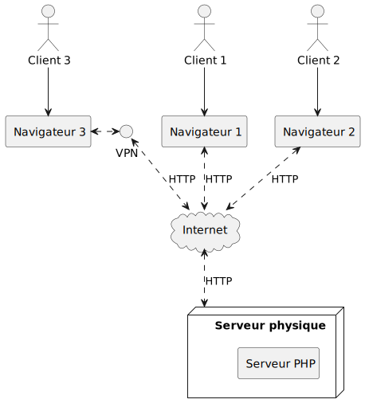
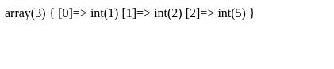

# 📜 | Introduction à PHP

## PHP, qu'est-ce que c'est ?

PHP, acronyme de "PHP: Hypertext Preprocessor", est un langage de script principalement conçu pour le développement web. PHP a vu le jour en 1995 avec sa première version créée par Rasmus Lerdorf, et depuis, il a considérablement évolué pour devenir l'un des langages de script les plus utilisés pour le développement web. Écrit en C, PHP tire parti de la performance et de la flexibilité offertes par ce langage de bas niveau, tout en fournissant une syntaxe plus simple et accessible aux développeurs web. La version actuelle, 8.3.9, intègre de nombreuses améliorations et nouvelles fonctionnalités par rapport à ses prédécesseurs, telles que des optimisations de performance, des améliorations de sécurité, et des fonctionnalités de programmation modernes. Grâce à ces mises à jour régulières, PHP continue de s'adapter aux besoins évolutifs du développement web moderne et reste un choix pertinent pour le développement côté serveur.

<details>
    <summary>**Scripting**</summary>

    Contrairement aux langages de programmation traditionnels qui nécessitent la création de programmes complets, un langage de script comme PHP est utilisé pour écrire de petits scripts ou fichiers qui exécutent des actions spécifiques sur un serveur web.
</details>

<details>
    <summary>**Interprété**</summary>

    PHP est **interprété**, c'est-à-dire que le code est **exécuté ligne par ligne par un interpréteur**, contrairement aux langages compilés (comme C, C++ ou Java) où le code source est transformé en code machine/binaire avant d'être exécuté.
</details>

<details>
    <summary>**Multi-plateforme**</summary>

    PHP est **multi-plateforme**, ce qui signifie qu'**il peut fonctionner sur différents systèmes d'exploitation**, tout comme Java.
</details>

<details>
    <summary>**Programmation Orientée Object**</summary>

    Il prend également en charge la **Programmation Orientée Objet (POO)**, permettant la création de classes, d'objets, et l'utilisation de concepts comme l'héritage et le polymorphisme. 
</details>

<details>
    <summary>**Faiblement typé**</summary>

    PHP est faiblement typé (ou typé de manière souple), ce qui signifie que les types de données des variables ne sont pas strictement définis et peuvent être changés dynamiquement (ex: un int peut devenir un string), facilitant ainsi l'écriture du code mais pouvant parfois conduire à des erreurs subtiles.
</details>

<details>
    <summary>**Execution côté serveur**</summary>

    À noter que PHP s'exécute uniquement côté serveur : **le code est interprété sur le serveur**, puis le **résultat est renvoyé au client** (navigateur web), ce qui en fait un langage idéal pour la création de pages web dynamiques.


</details>

## Coder en PHP

:::tip
Toujours garder la [documentation de PHP](https://www.php.net/manual/fr/) près de soi
:::

- Extension ".php"
- Les variables ont toutes un `$`, ex: `$ma_var`
- Point virgule à la fin des lignes
- Convention de nommage snake_case, ex `ma_super_fonction`
- Tous les fichiers commencent avec `<?php`, et peuvent finir par `?>`
- Il est possible de mettre des balises `<?php ... ?>` dans du HTML (toujours dans un fichier `.php`)

```php
<div>
    <p>Mon paragraphe</p>
    <div><?php echo $ma_var; ?></div>
</div>
```

- - -

Exemple de code PHP :

```php
<?php

$ma_var = 12;

if ($ma_var == 12) {
    echo "Coucou !\n";
}
else {
    $ma_var = null;
}
```

## Différences de PHP

### Echo

Print avec `echo` (ne pas oublier d'ajouter un `\n`, car il ne retourne pas à la ligne)

```php
$ma_var = "toto";
echo $ma_var;
echo "Salut c'est $ma_var\n";
```


### Debug

Debugguer une variable avec `var_dump()`. Cela permet d'afficher le contenu complet de la variable au moment où est appelée la fonction pour régler d'éventuels problèmes.

```php
$ma_var = [1, 2, 5];
var_dump($ma_var);
```



### For each

Le `for each` ("pour chaque")

```php
$mes_valeurs = [1, 2, 3, 4];

foreach ($mes_valeurs as $var) {
    echo "$var\n";
}
```

<details>
    <summary>🖥️ Sortie</summary>
```
1
2
3
4
```
</details>

Il est aussi possible d'utiliser une clé

```php
$mes_valeurs = [10, 11, 12, 13];

foreach ($mes_valeurs as $index => $var) {
    echo "$index: $var\n";
}
```

<details>
    <summary>🖥️ Sortie</summary>
```
0: 10
1: 11
2: 12
3: 13
```
</details>

### Match

Plus récent, le `match`

```php
$ma_var = 2;

$mon_autre_var = match ($ma_var) {
    1, 2 => "toto",
    $ma_var > 10 => "tata",
    default => "cas par défaut"
};

echo $mon_autre_var;
```
<details>
    <summary>🖥️ Sortie</summary>
```
toto
```
</details>

### Tableaux associatifs

Pour créer des tableaux avec des index personnalisés (comme un dictionnaire)

```php
$ma_var = [
    0 => "toto",
    "mon index 1" => "tata",
    "mon autre index" => "tonton" 
];

echo $ma_var["mon autre index"];
```
<details>
    <summary>🖥️ Sortie</summary>
```
tonton
```
</details>

### Opérateur "." pour ajouter des strings

Pour ajouter/concatener des strings en PHP, on utilise l'opérateur `.`

```php
echo "mon string 1" . "mon string 2";
```

<details>
    <summary>🖥️ Sortie</summary>
```
mon string 1mon string 2
```
</details>