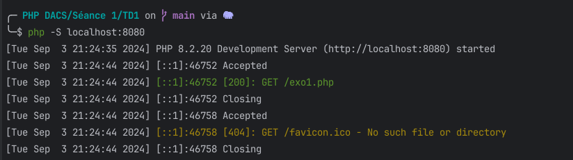

---
categories:
- 📚 TD/TP

references:
  - 📜 | Introduction à PHP
---

# 📚 | TD 1 : Premiers scripts

## Cloner le projet

Cloner le projet https://github.com/PHP-BUT2-DACS/TP-TD

```shell
git clone https://github.com/PHP-BUT2-DACS/TP-TD.git
```

:::warning
**Ce projet vous servira tout le long du module**. Gardez le précieusement !
:::

## Faire les exercices

1. Dans un terminal, exécutez la commande `php -v` (ou `php --version`) pour être informé de la version de votre interpréteur PHP.

2. Ensuite, naviguez jusqu'au dossier du projet `/Séance 1/TD1`. Puis démarrez le serveur PHP avec la commande suivante :

```shell
php -S localhost:8080
```

<details>
    <summary>Comprendre la commande</summary>

- `php` fait référence à l'interpréteur PHP pré-installé sur votre machine.
- L'option `-S` (pour **S**erver) permet de **créer un serveur PHP**. Cette option nécessite deux paramètres :
    - `<addr>`, c'est-à-dire **l'adresse à laquelle on veut utiliser notre serveur** (`localhost`, correspond à l'hôte local)
    - `<port>` permet de préciser **le port à utiliser** pour l'adresse précédemment fournie. En informatique, il est couramment admis que les ports 808X, 800X, 300X, 500X sont réservés pour le développement.
</details>

3. Ouvrir le navigateur à l'URL [http://localhost:8080/exo1.php](http://localhost:8080/exo1.php)

4. Une fois la commande lancée et l'URL ouverte, votre terminal devrait afficher quelque-chose de similaire :

:::info 🖥️ Sortie

:::

5. Répondez aux exercices du TD1. Vous pouvez demander de l'aide si nécessaire.

:::tip
La commande `php -h` (ou `php --help`) pourra vous aider si vous êtes perdus avec d'autres commandes de PHP.
:::

6. Push les modifications

:::warning
N'oubliez pas de push les modifications sur votre repository GitHub
:::

Il faudra créer un repository dans l'organisation https://github.com/PHP-BUT2-DACS, portant le nom `TP-TD-<MON-NOM>`. Par exemple : `TP-TD-CAPOSIENA`.

Il faudra ensuite changer l'URL de mon clone local vers le repository fraichement créé. Cela peut être fait depuis le repository `TD-TD` cloné précédemment via la commande suivante :

```shell
git remote set-url origin https://github.com/PHP-BUT2-DACS/TP-TD-<MON-NOM>.git
```

Ensuite,
- `git add -A`
- `git commit -m "mon message"`
- `git push`