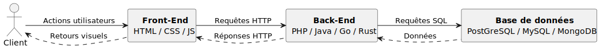
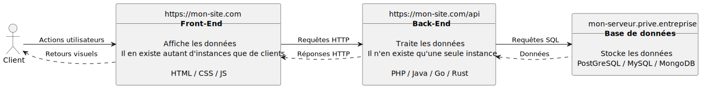

---
categories:
- 📜 Cours théorique

references:
- 📜 | Introduction à PHP
- 📜 | Anatomie du protocole HTTP
---

# 📜 | Architecture d'une application web

:::info
Cette partie n'est pas à apprendre en détails. Cependant, **la compréhension des différents termes évoqués est nécessaire**.
:::

Dans ce cours, nous allons explorer l'architecture typique d'une application web en distinguant les rôles du **client**, du **front-end**, du **back-end**, et de la **base de données**. Chaque composant joue un rôle crucial dans le traitement des requêtes et des réponses qui permettent aux utilisateurs d'interagir avec une application web.

Voici un diagramme pour faciliter la compréhension tout au long de l'explication :

    
Version plus détaillée

:::tip En analogie 🥖
Imaginons une boulangerie pour illustrer le fonctionnement d'une application web.

- Le **client** est simplement la personne qui entre dans la boulangerie.
- La **vendeuse** représente le **front-end**.
- Le **boulanger** en cuisine, correspond au **back-end**.
- Le **stock de ressources**, représente la **base de données**.

La vendeuse prend la commande du client (comme le front-end qui capture les actions utilisateurs) et, si nécessaire, envoie une demande au boulanger.
Le boulanger, lui, prépare le pain ou vérifie dans le stock de ressources, pour voir s'il a les ingrédients ou les produits nécessaires.
Une fois la demande traitée, le boulanger transmet le pain à la vendeuse, qui le remet au client, tout comme le front-end affiche les résultats après que le back-end a traité les données.
À aucun moment le client n'a intéragit avec le boulanger ou le sock de ressources.
:::

## Le rôle du client

Le **client** représente l'utilisateur qui interagit avec une application web à l'aide d'un navigateur. Il envoie des actions, généralement sous forme de clics, soumissions de formulaires, ou autres interactions avec l'interface visuelle. Le client ne fait qu'exécuter des actions, sans avoir directement accès au traitement des données ou à la logique de l'application. Tout ce qu'il voit se limite à l'interface utilisateur visible dans le navigateur.

## Front-End : Côté client

Le **front-end** désigne la partie visible de l'application avec laquelle le client interagit directement. Il est composé principalement de trois technologies :

- **HTML** : structure les pages web en définissant les éléments visibles (textes, images, boutons, etc.).
- **CSS** : stylise ces éléments pour améliorer la présentation (couleurs, polices, marges, etc.).
- **JavaScript (JS)** : ajoute de l'interactivité dynamique, par exemple, la mise à jour de contenu sans recharger la page entière.

Le front-end prend en charge les **actions de l'utilisateur**, comme un clic sur un bouton ou la soumission d'un formulaire, puis envoie ces actions au back-end sous forme de **requêtes HTTP**. Il est responsable de l'affichage des résultats et des retours visuels une fois que le back-end a traité la demande.

:::info
Le front-end est **obligatoire**. Sans HTML, il n'existe pas de site (et donc pas de WEB).
:::

:::warning
Comme cité dans la séance 1, le PHP s'exécute côté serveur. Même si le PHP est utilisé pour faire du front-end, le rendu de la page se fera côté serveur, et ensuite le client réceptionne le HTML/CSS/JS créé au préalable. Cette notion est appelée **Server Side Rendering** (ou **SSR**).

:::danger
**Le client ne peut pas exécuter de PHP**, il ne reçoit toujours que du HTML/CSS/JS.
:::

## Back-End : Côté serveur

Le **back-end** est la partie cachée de l'application qui s'occupe du traitement des requêtes. C'est ici que la logique métier et les règles de gestion de l'application résident. Différents langages peuvent être utilisés pour coder la logique serveur, parmi lesquels :

- **PHP** : souvent utilisé pour gérer des sites dynamiques et interagir avec des bases de données.
- **Java** : utilisé pour les applications robustes et à grande échelle.
- **Go** ou **Rust** : de plus en plus utilisés pour des raisons de performance et de sécurité.

Le back-end reçoit les **requêtes HTTP** provenant du front-end, effectue les calculs nécessaires ou exécute les règles de gestion, et peut, si nécessaire, communiquer avec une base de données pour récupérer ou stocker des informations.

:::info
Le back-end est **optionnel**.
:::

## Base de données : Côté données

La **base de données** est l'endroit où les informations sont stockées. Elle permet de sauvegarder des données de manière structurée, facilitant ainsi leur gestion et récupération par le back-end. Les bases de données peuvent être relationnelles ou non relationnelles, et parmi les plus courantes, nous avons :

- **PostgreSQL** : une base de données relationnelle très puissante.
- **MySQL** : une autre base de données relationnelle, très populaire pour des projets de tailles variées.
- **MongoDB** : une base de données non relationnelle (NoSQL), idéale pour stocker des documents JSON et des données semi-structurées.

Le back-end envoie des **requêtes SQL** à la base de données pour récupérer ou modifier les données en fonction des besoins de l'application. Une fois les données récupérées ou modifiées, elles sont renvoyées au back-end, qui les traite et les formate avant de les transmettre au front-end.

:::info
La base de données est **optionnelle**.
:::

## Cycle de traitement complet

Pour récapituler, le cycle de traitement d'une application web se déroule comme suit :

1. Le **client** effectue une action via l'interface utilisateur.
2. Le **front-end** capture cette action et envoie une **requête HTTP** au **back-end**.
3. Le **back-end** traite la requête et, si nécessaire, envoie une **requête SQL** à la **base de données** pour accéder ou modifier des informations.
4. La **base de données** renvoie les données au **back-end**, qui les formate en **réponse HTTP**.
5. Le **back-end** renvoie cette réponse au **front-end**, qui met à jour l'interface et affiche les informations pertinentes au **client**.

Ce modèle d'interaction est typique de la majorité des applications web modernes et repose sur une division claire des rôles entre les différentes couches pour une meilleure organisation et maintenabilité du code.

## Stack & Full-stack

Le terme **stack WEB** correspond à l'ensemble du front-end, back-end et de la base de données (ou même l'administration de ces systèmes). Un développeur **full-stack** est développeur qui maître et utilise l'ensemble de ces aspects.