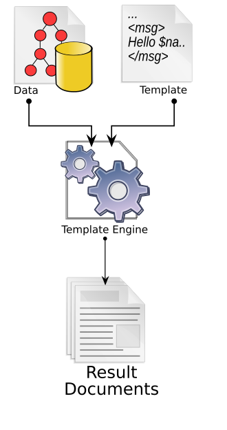

---
categories:
- 📜 Cours théorique
---

# 📜 | Qu'est-ce qu'un moteur de templating

:::info
Cette partie n'est pas à apprendre en détails. Cependant, **la compréhension des différents termes évoqués est nécessaire**.
:::

## Définition

Un **moteur de template** est un logiciel conçu pour combiner des **modèles** (template) avec un **modèle de données** afin de produire des documents finaux. Ces documents finaux sont souvent des pages Web, mais ils peuvent aussi être d'autres types de documents, tels que des fichiers PDF, des courriels ou des documents XML.

Dans le contexte du développement web, un moteur de template est généralement utilisé pour générer dynamiquement des pages HTML. **Le processus de génération de pages se déroule majoritairement côté serveur**, bien qu'il puisse aussi se produire côté client avec des frameworks JavaScript modernes (Svelte, React, Vue JS, ...).




Les moteurs de modèles incluent généralement des fonctionnalités communes à la plupart des langages de programmation de haut niveau, avec un accent sur les fonctionnalités de traitement du texte brut.

Ces fonctionnalités incluent :

- variables
- évaluation conditionnelle et boucles
- remplacement de texte
- inclusion (ou transclusion) de fichier
- fonctions

## Exemples de moteurs PHP existants

### Twig

Twig est un moteur de templates pour le langage de programmation PHP, utilisé par défaut par le framework Symfony. Il a été inspiré par Jinja, moteur de template Python.

https://twig.symfony.com/

**variable**
```
{{ var }}
```

**if**
```

    <ul>
        
            <li>{{ user.username|e }}</li>
        
    </ul>

```

**for**
```

* {{ user.name }}

No users have been found.

```

**require**
```

```

### Blade

Laravel Blade est le moteur de modèles par défaut du framework Laravel. Il vous permet d’utiliser des variables, des boucles, des instructions conditionnelles et d’autres fonctionnalités PHP directement dans votre code HTML.

https://laravel.com/docs/11.x/blade

**variable**
```bladehtml
Hello, {{ $name }}.
```

**if**
```bladehtml
@if (count($records) === 1)
    I have one record!
@elseif (count($records) > 1)
    I have multiple records!
@else
    I don't have any records!
@endif
```

**for**
```bladehtml
@for ($i = 0; $i < 10; $i++)
    The current value is {{ $i }}
@endfor

@foreach ($user->posts as $post)
    <p>This is user {{ $user->id }}</p>
@endforeach
```

**require**
```bladehtml
@include('footer.html')
```