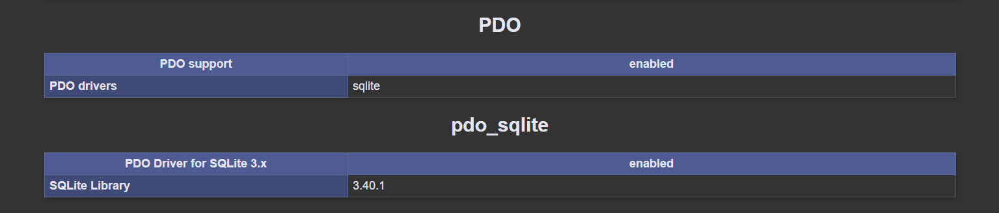

---
categories:
  - ⚙️ Cours pratique
---

# ⚙️ | Interaction entre PHP et une Base de Données avec PDO


## PDO, qu'est-ce que c'est ?

**PDO (PHP Data Objects)** est une interface légère et orientée objet pour interagir avec des bases de données dans PHP. Elle permet de communiquer avec plusieurs systèmes de bases de données (MySQL, SQLite, PostgreSQL, etc.) via une API unique, facilitant la portabilité du code et simplifiant les interactions avec les bases de données.

PDO offre plusieurs avantages par rapport aux autres extensions PHP comme mysqli ou mysql :

- **Support multi-base** : PDO fonctionne avec différents types de bases de données (SQLite, MySQL, PostgreSQL, etc.).
- **Sécurité accrue** : Les requêtes préparées empêchent les injections SQL.
- **Flexibilité** : Une API unique pour gérer toutes les bases de données, facilitant les migrations.
- **Approche orientée objet** : Favorise un code structuré et maintenable.

<details>
    <summary>Exemple de connexion à une base de données MySQL</summary>

```php
<?php

try {
    $pdo = new PDO('mysql:host=localhost;dbname=ma_base', 'username', 'password');
    $pdo->setAttribute(PDO::ATTR_ERRMODE, PDO::ERRMODE_EXCEPTION);
    echo "Connexion à MySQL réussie !";
}
catch (PDOException $e) {
    echo "Erreur de connexion : " . $e->getMessage();
}

```
</details>

## Pourquoi utiliser SQLite avec PHP ?

SQLite est une base de données légère et intégrée, idéale pour les applications qui ne nécessitent pas un serveur de base de données externe. PHP offre un support natif pour interagir avec SQLite via l'extension **PDO**, qui fournit une interface uniforme pour communiquer avec différentes bases de données.

- **Léger** : SQLite est un fichier autonome qui ne nécessite pas de serveur.
- **Portable** : La base de données est stockée dans un seul fichier, ce qui facilite le déploiement.
- **Intégré** : PHP inclut nativement le support de SQLite via PDO.

<details>
    <summary>Configuration de PHP pour utiliser SQLite (si nécessaire)</summary>

Aucune installation supplémentaire n’est nécessaire si PHP a été compilé avec le support de SQLite. Assurez-vous simplement que l'extension PDO est activée dans le fichier `php.ini` :

```ini
extension=pdo_sqlite
```

Pour vérifier si SQLite est disponible, utilisez :

```php
<?php
phpinfo();
?>
```

Une fois sur la page `phpinfo()`, vous devriez trouver (en descendant) :


</details>

## Connexion à une Base de Données (SQLite)

Pour établir une connexion, utilisez la classe `PDO`. Si le fichier de la base n'existe pas, SQLite le crée automatiquement.

**Exemple** :
```php
<?php

try {
    $pdo = new PDO('sqlite:ma_base.sqlite');
    // Configuration des options PDO
    $pdo->setAttribute(PDO::ATTR_ERRMODE, PDO::ERRMODE_EXCEPTION);
    echo "Connexion réussie à SQLite !";
}
catch (PDOException $e) {
    echo "Erreur de connexion : " . $e->getMessage();
}
```

## Intéragir avec la Base de Données

### Lecture de Données

Utilisez `query()` pour exécuter une requête SELECT et récupérer les résultats avec `fetch()` ou `fetchAll()`.

**Exemple** : Récupérer tous les utilisateurs
```php
<?php

try {
    $pdo = new PDO('sqlite:ma_base.sqlite');
    $pdo->setAttribute(PDO::ATTR_ERRMODE, PDO::ERRMODE_EXCEPTION);

    $result = $pdo->query("SELECT * FROM utilisateurs");

    foreach ($result as $row) {
        echo "Nom : {$row['nom']} Email : {$row['email']}, Age : {$row['age']}<br>";
    }
} catch (PDOException $e) {
    echo "Erreur : " . $e->getMessage();
}
?>
```

### Création de Table

Pour créer une table, on utilise une requête SQL avec la méthode `exec()`.

**Exemple** : Création d'une table `utilisateurs`
```php
<?php
try {
    $pdo = new PDO('sqlite:ma_base.sqlite');
    $pdo->setAttribute(PDO::ATTR_ERRMODE, PDO::ERRMODE_EXCEPTION);

    $sql = "
    CREATE TABLE IF NOT EXISTS utilisateurs (
        id INTEGER PRIMARY KEY AUTOINCREMENT,
        nom TEXT NOT NULL,
        email TEXT NOT NULL UNIQUE,
        age INTEGER
    )";
    $pdo->exec($sql);
    echo "Table 'utilisateurs' créée avec succès.";
}
catch (PDOException $e) {
    echo "Erreur : " . $e->getMessage();
}
?>
```

### Insertion de Données

Pour insérer des données, utilisez une requête préparée avec `prepare()` pour éviter les injections SQL.

**Exemple** :
```php
<?php

try {
    $pdo = new PDO('sqlite:ma_base.sqlite');
    $pdo->setAttribute(PDO::ATTR_ERRMODE, PDO::ERRMODE_EXCEPTION);

    $sql = "INSERT INTO utilisateurs (nom, email, age) VALUES (:nom, :email, :age)";
    $stmt = $pdo->prepare($sql);

    $stmt->execute([
        ':nom' => 'Alice',
        ':email' => 'alice@example.com',
        ':age' => 25
    ]);

    echo "Utilisateur ajouté avec succès.";
} catch (PDOException $e) {
    echo "Erreur : " . $e->getMessage();
}
?>
```

### Mise à Jour de Données

Utilisez `prepare()` et `execute()` pour mettre à jour des données existantes.

**Exemple** : Mise à jour de l'âge d'un utilisateur
```php
<?php

try {
    $pdo = new PDO('sqlite:ma_base.sqlite');
    $pdo->setAttribute(PDO::ATTR_ERRMODE, PDO::ERRMODE_EXCEPTION);

    $sql = "UPDATE utilisateurs SET age = :age WHERE email = :email";
    $stmt = $pdo->prepare($sql);

    $stmt->execute([
        ':age' => 30,
        ':email' => 'alice@example.com'
    ]);

    echo "Mise à jour effectuée.";
} catch (PDOException $e) {
    echo "Erreur : " . $e->getMessage();
}
?>
```

### Suppression de Données

Pour supprimer une ligne, utilisez une requête DELETE avec des paramètres préparés.

**Exemple** : Supprimer un utilisateur
```php
<?php

try {
    $pdo = new PDO('sqlite:ma_base.sqlite');
    $pdo->setAttribute(PDO::ATTR_ERRMODE, PDO::ERRMODE_EXCEPTION);

    $sql = "DELETE FROM utilisateurs WHERE email = :email";
    $stmt = $pdo->prepare($sql);

    $stmt->execute([':email' => 'alice@example.com']);

    echo "Utilisateur supprimé.";
} catch (PDOException $e) {
    echo "Erreur : " . $e->getMessage();
}
?>
```