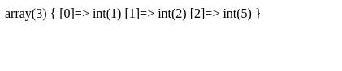

# 📜 | Introduction to PHP

PHP, short for "PHP: Hypertext Preprocessor," is a scripting language primarily designed for web development. PHP was created in 1995 with its first version developed by Rasmus Lerdorf, and since then, it has evolved significantly to become one of the most widely used scripting languages for web development. Written in C, PHP leverages the performance and flexibility offered by this low-level language while providing a simpler and more accessible syntax for web developers. The current version, 8.3.9, incorporates numerous improvements and new features compared to its predecessors, such as performance optimizations, security enhancements, and modern programming capabilities. With these regular updates, PHP continues to adapt to the evolving needs of modern web development and remains a relevant choice for server-side development.

<details>
    <summary>**Scripting**</summary>

    Unlike traditional programming languages that require the creation of complete programs, a scripting language like PHP is used to write small scripts or files that perform specific actions on a web server.
</details>

<details>
    <summary>**Interpreted**</summary>

    PHP is **interpreted**, meaning that the code is **executed line by line by an interpreter**, unlike compiled languages (such as C, C++, or Java) where the source code is transformed into machine/binary code before execution.
</details>

<details>
    <summary>**Cross-platform**</summary>

    PHP is **cross-platform**, which means that **it can run on different operating systems**, similar to Java.
</details>

<details>
    <summary>**Object-Oriented Programming**</summary>

    It also supports **Object-Oriented Programming (OOP)**, allowing the creation of classes, objects, and the use of concepts like inheritance and polymorphism.
</details>

<details>
    <summary>**Weakly Typed**</summary>

    PHP is weakly typed (or loosely typed), which means that variable data types are not strictly defined and can be changed dynamically (e.g., an int can become a string), making code writing easier but sometimes leading to subtle errors.
</details>

<details>
    <summary>**Server-Side Execution**</summary>

    Note that PHP only runs on the server side: **the code is interpreted on the server**, and then the **result is sent back to the client** (web browser), making it an ideal language for creating dynamic web pages.


</details>

## Coding in PHP

:::tip
Always keep the [PHP documentation](https://www.php.net/manual/en/) close by
:::

- Extension ".php"
- All variables start with `$`, e.g., `$my_var`
- Semicolon at the end of lines
- Naming convention is snake_case, e.g., `my_super_function`
- All files start with `<?php`, and can end with `?>`
- It is possible to use `<?php ... ?>` tags within HTML (always in a `.php` file)

```php
<div>
    <p>Mon paragraphe</p>
    <div><?php echo $ma_var; ?></div>
</div>
```

## PHP Differences

### Echo

Printing with `echo` (don't forget to add a `\n` for a new line, as it doesn't automatically go to the next line)

```php
$my_var = "toto";
echo $my_var;
echo "Hello it's $my_var\n";
```


### Debug

Debug a variable with `var_dump()`. This allows you to display the complete content of the variable when the function is called to fix any potential issues.

```php
$my_var = [1, 2, 5];
var_dump($my_var);
```



### For each

The `for each` loop

```php
$mes_valeurs = [1, 2, 3, 4];

foreach ($mes_valeurs as $var) {
    echo "$var\n";
}
```

<details>
    <summary>🖥️ Output</summary>
```
1
2
3
4
```
</details>

It is also possible to use a key

```php
$mes_valeurs = [10, 11, 12, 13];

foreach ($mes_valeurs as $index => $var) {
    echo "$index: $var\n";
}
```

<details>
    <summary>🖥️ Output</summary>
```
0: 10
1: 11
2: 12
3: 13
```
</details>

### Match

Newest, the `match`

```php
$ma_var = 2;

$mon_autre_var = match ($ma_var) {
    1, 2 => "toto",
    $ma_var > 10 => "tata",
    default => "cas par défaut"
};

echo $mon_autre_var;
```
<details>
    <summary>🖥️ Output</summary>
```
toto
```
</details>

### Associative Arrays

To create arrays with custom indexes (like a dictionary)

```php
$ma_var = [
    0 => "toto",
    "mon index 1" => "tata",
    "mon autre index" => "tonton" 
];

echo $ma_var["mon autre index"];
```
<details>
    <summary>🖥️ Output</summary>
```
tonton
```
</details>

### Concatenation Operator "." for Adding Strings

To add/concatenate strings in PHP, we use the `.` operator

```php
echo "my string 1" . "my string 2";
```

<details>
    <summary>🖥️ Output</summary>
```
my string 1my string 2
```
</details>
