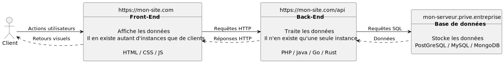

---
categories:
- 📜 Theoretical course

references:
- 📜 | Introduction to PHP
---

# 📜 | Web application architecture

:::info
This part is not to be learned in detail. However, **understanding the different terms mentioned is necessary**.
:::

In this course, we will explore the typical architecture of a web application by distinguishing the roles of the **client**, **front-end**, **back-end**, and **database**. Each component plays a crucial role in processing requests and responses that allow users to interact with a web application.

Here is a diagram to facilitate understanding throughout the explanation:

    
More detailed version

:::tip In analogy 🥖
Let's imagine a bakery to illustrate how a web application works.

- The **client** is simply the person who enters the bakery.
- The **saleswoman** represents the **front-end**.
- The **baker** in the kitchen corresponds to the **back-end**.
- The **resource stock** represents the **database**.

The saleswoman takes the client's order (like the front-end capturing user actions) and, if necessary, sends a request to the baker.
The baker then prepares the bread or checks in the resource stock to see if he has the necessary ingredients or products.
Once the request is processed, the baker hands the bread to the saleswoman, who gives it to the client, just like the front-end displays the results after the back-end has processed the data.
At no point does the client interact with the baker or the resource stock.
:::

## The role of the client

The **client** represents the user who interacts with a web application using a browser. It sends actions, usually in the form of clicks, form submissions, or other interactions with the visual interface. The client only performs actions, without direct access to data processing or application logic. Everything the client sees is limited to the user interface visible in the browser.

## Front-End: Client-Side

The **front-end** refers to the visible part of the application with which the client interacts directly. It is mainly composed of three technologies:

- **HTML**: structures web pages by defining visible elements (texts, images, buttons, etc.).
- **CSS**: styles these elements to enhance the presentation (colors, fonts, margins, etc.).
- **JavaScript (JS)**: adds dynamic interactivity, for example, updating content without reloading the entire page.

The front-end handles **user actions**, such as clicking a button or submitting a form, then sends these actions to the back-end in the form of **HTTP requests**. It is responsible for displaying the results and visual feedback once the back-end has processed the request.

:::info
The front-end is **mandatory**. Without HTML, there is no website (and therefore no WEB).
:::

:::warning
As mentioned in session 1, PHP runs on the server side. Even if PHP is used for front-end tasks, the page rendering occurs on the server side, and then the client receives the previously created HTML/CSS/JS. This concept is known as **Server Side Rendering** (or **SSR**).
:::

:::danger
**The client cannot execute PHP**, it always receives only HTML/CSS/JS.
:::

## Back-End: Server-Side

The **back-end** is the hidden part of the application that handles request processing. This is where the business logic and application rules reside. Different languages can be used to code the server logic, including:

- **PHP**: often used to manage dynamic sites and interact with databases.
- **Java**: used for robust and large-scale applications.
- **Go** or **Rust**: increasingly used for performance and security reasons.

The back-end receives **HTTP requests** from the front-end, performs necessary calculations or executes business rules, and can, if needed, communicate with a database to retrieve or store information.

:::info
The back-end is **optional**.
:::

## Database: Data Side

The **database** is where information is stored. It allows data to be saved in a structured way, making it easier to manage and retrieve by the back-end. Databases can be relational or non-relational, and among the most common ones, we have:

- **PostgreSQL**: a very powerful relational database.
- **MySQL**: another relational database, very popular for projects of various sizes.
- **MongoDB**: a non-relational database (NoSQL), ideal for storing JSON documents and semi-structured data.

The back-end sends **SQL queries** to the database to retrieve or modify data according to the application's needs. Once the data is retrieved or modified, it is sent back to the back-end, which processes and formats it before transmitting it to the front-end.

:::info
The database is **optional**.
:::

## Complete Processing Cycle

To summarize, the processing cycle of a web application unfolds as follows:

1. The **client** performs an action via the user interface.
2. The **front-end** captures this action and sends an **HTTP request** to the **back-end**.
3. The **back-end** processes the request and, if necessary, sends an **SQL query** to the **database** to access or modify information.
4. The **database** returns the data to the **back-end**, which formats it into an **HTTP response**.
5. The **back-end** sends this response to the **front-end**, which updates the interface and displays relevant information to the **client**.

This interaction model is typical of the majority of modern web applications and relies on a clear division of roles between the different layers for better code organization and maintainability.

## Stack & Full-stack

The term **WEB stack** corresponds to the entire front-end, back-end, and database (or even the administration of these systems). A **full-stack** developer is a developer who masters and uses all these aspects.
