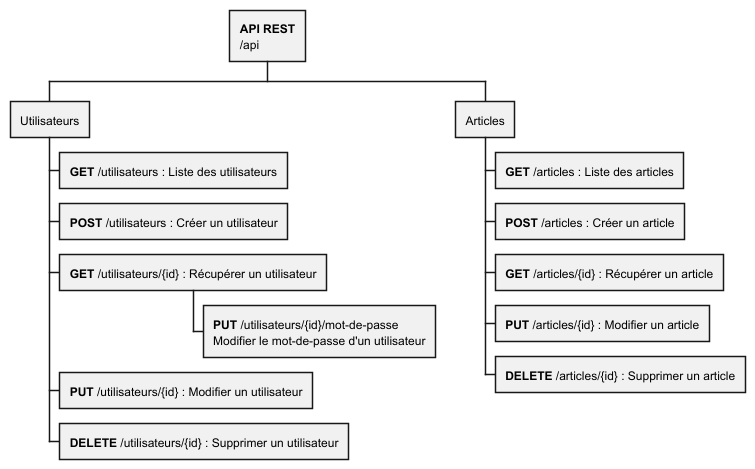

---
categories:
- 📜 Theoretical Course
---

# 📜 | What is an API

:::info
This part is not to be learned in detail. However, **understanding the different terms mentioned is necessary**.
:::

## API

An **API** (Application Programming Interface) is a set of rules and conventions that allow different applications or services to communicate with each other. APIs have become an essential component of modern software development, enabling applications to interact with web services, databases, or even other applications. They standardize data exchanges, thus facilitating integration and feature extension.

:::info
An API is server-side (back-end).
:::

### What is an API?

An API defines **entry points** (endpoints or URLs) that other applications can use to interact with a given service. When an application sends a request to an API, it receives a structured response, usually in **JSON** or **XML** format, containing the requested data or a status message.

### **REST API (Representational State Transfer)**

REST is an architectural style that relies on standard HTTP methods such as `GET`, `POST`, `PUT`, `DELETE`, etc. Data is typically exchanged in **JSON** or **XML** format.

**Characteristics**:
    - **Stateless**: Each request contains all necessary information, without depending on server-side stored state.
    - **Scalability**: Highly flexible and scalable, REST is widely used for modern web services.

**Example**:
```http
GET /users/42
```
This type of request would return information about the user with ID 42.

It is also possible to represent a REST API in a tree structure, as shown here:


